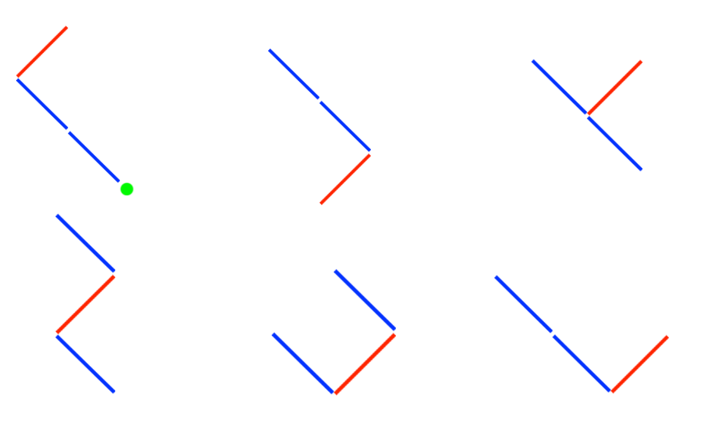

## 문제

You are the best garden designer. You are trying to create a new style of tree. It is called “Left-Right Tree”. These are all details of the style.

1. Left-Right Tree is a binary tree.
2. Left-Right Tree has only 1 root node.
3. Left-Right Tree has exactly N left sticks and M right sticks.

You are trying to draw all possible Left-Right Tree following the details. But it is impossible to do this!, so you want to calculate the number of all possible tree instead.

Count all possible Left-Right Tree following the details and modulo the answer with 9999991.

## 입력

First line, type T (Number of questions) .

i+1th line, type 2 numbers including N (Number of left sticks) and M (Number of right sticks). (0 ≤ N, M ≤ 125)

## 출력

There are T lines.

ith line, display the answer of the ith question.

## 힌트

In case of i = 1; There are 1 left stick and 1 right stick. The answer is 3.

In case of i = 2; There are 2 left stick and 1 right stick. There are pictures of possible LeftRight Tree.

