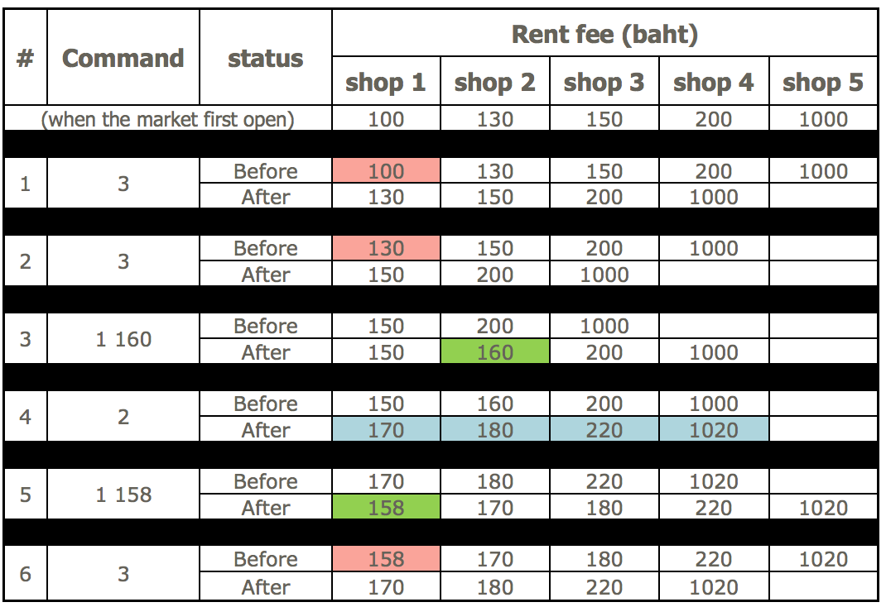

## 문제

There is a new opened market named “Goods Market”. Many people go there, selling things and buy things. When the market first opens, there are only N shops. After that, some new shops will be opened. The market is very very big and can hold unlimited number of shops. The advantages of open the shop in this market is you can set your own rent fee.

But there is one another rule. If the market owner wants to raise the rent fee, every shop in the market has to raise the fee for K baht. For example if the market owner set the K to 100 baht, every time the market owner wants to raise the fee, the fee should raise for 100 baht. If the market owner wants to raise the fee 2 times, The shops that opened before all two rent raising will have to pay original amount +200 baht, but shop that open before second raise but after first raise will only have to pay +100 baht.

This market has a lot of tenants because they allow unlimited number of shops. So the owner has to try to reduce number by evicting shops, by evicting the shop with cheapest rent fee. The time to evict shop are also up to the owner.

If Goods Markey has done M operation, of which there are three types:

1. There’s a new shop, at price P baht.
2. Increase price of all shops.
3. Evict one shop.

Find all the number of shops at the end of operation, and what is sum of their rent.

## 입력

First line has integer T (1 ≤ T ≤ 20) representing the number of question.

First line has three integers: N, M, K (1 ≤ N, M ≤ 100,000 and 1 ≤ K ≤ 100)

Next line has N integers, Xi representing initial rent price of shop i (1 ≤ Xi ≤ 10,000,000)

Following M lines, each lines has integer A to determine operation type

* (1) is to add new shop, with another integer P represent initial rent price. (1 ≤ P ≤ 10,000,000)
* (2) Increase rent fee.
* (3) Evict shops

## 출력

Each line has two integers, which is the number of shop and total rent fee at the end of operation for each question.

## 힌트

Initial there are 5 shops, 100, 130, 150, 200, 1000 baht.

After all 6 operations There are 4 shops, with rent 170 + 180 + 220 + 1,020 = 1,590
