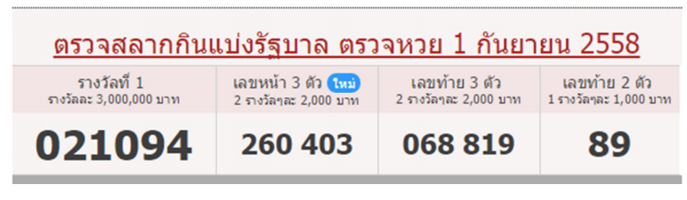

## 문제

ตรวจรางวัลสลากกินแบ่งรัฐบาล

จงเขียนโปรแกรมตรวจผลรางวัลสลากกินแบ่งรัฐบาลประเทศไทย ซึLงล็อตเตอรีL(Lottery) ประกอบด้วย ตัวเลขหกหลัก โดยรางวัลทีLตรวจจะมีดังต่อไปนี  รางวัลทีL 1, รางวัลเลขหน้าสามตัว 2 รางวัล, รางวัลเลขท้ายสามตัว 2 รางวัล และรางวัลเลขท้ายสองตัว 1 รางวัล

กรณีล็อตเตอรีLถูกรางวัลมากกว่าหนึLงรางวัล ให้รวมเงินรางวัลเข้าด้วยกัน โดยให้ตรวจหาเงินรางวัลทั งหมด ทีLเป็นไปได้ของล็อตเตอรีLแต่ละใบ

## 입력

กําหนดให้ อินพุตประกอบด้วยสองส่วน ส่วนแรกเป็นรายละเอียดของหมายเลขทีLได้รางวัลในแต่ละบรรทัด

ประกอบไปด้วย หมายเลขทีLออกและจํานวนเงินรางวัล ตามลําดับดังนี  รางวัลทีL 1, รางวัลเลขหน้าสามตัว W รางวัล, รางวัลเลขท้ายสามตัว W รางวัล และรางวัลเลขท้ายสองตัว 1 รางวัล

ส่วนทีLสอง เป็นเลขล็อตเตอรีLทีLต้องการจะตรวจ บรรทัดละหนึLงหมายเลข(ตัวเลขหกหลัก) โดยจะจบบรรทัด สุดท้ายด้วย -1

## 출력

แต่ละบรรทัด ให้พิมพ์จํานวนเงินรางวัลรวมทีLได้ตามลําดับของล็อตเตอรีLจากอินพุต
