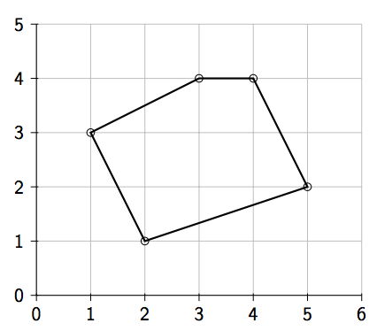

## 문제

Alicia is staying in a hotel on the edge of town. She sets out in the morning with a list of landmarks to visit all across the city. This day of sightseeing will take her through the city, visiting a number of locations, all the way to the far-side of city where she will pause for lunch at the prestigious Pete’s Polygon Pizza Parlour. Anything she misses must be visited on the return trip to the hotel in the evening.

Given the set of locations that Alicia would like to visit, find the length of the shortest tour which starts at her hotel, visits each of the locations, and returns back to the hotel. Beside the starting location, each location should be visited exactly once.

The starting hotel will be located at the leftmost x-coordinate. From there, the optimal path should visit locations at strictly increasing x-coordinates until Pete’s Parlour is reached at the rightmost x-coordinate. From here, the optimal return path should visit any and all unseen locations in strictly decreasing x-coordinates. Note that the x-coordinate of each location will be unique.

## 입력

The (x, y) coordinates of all locations are given as integers on a Euclidean plane. The first line of input contains a single integer n, 1 ≤ n ≤ 1000, representing the number of locations. Each of the next n lines contains two integers x and y, 0 ≤ x, y ≤ 100000, representing the coordinates of the n locations.

## 출력

The output should consist of a single decimal containing the the total length of the tour rounded to two decimal places. This should immediately be followed by a newline.

## 힌트

The locations and optimal solution for sample input 1.
