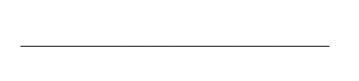
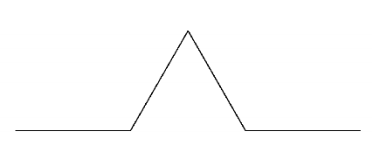
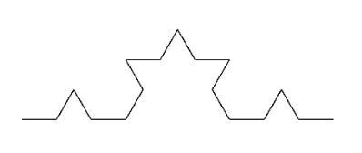
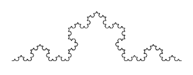

## 문제

The Koch curve or snowflake is drawn in the XY plane. It is defined recursively.

Start with a line of length 1 from (0,0) to (1,0). We call this a level 0 Koch curve.

Divide the line into thirds. Make an equilateral triangle on the centre third, then delete the bottom edge of the triangle. This is a level 1 Koch curve.

Divide and put triangles on each of the sections of the level 1 curve. This results in a level 2 curve.

And so on. Here is a level 4 curve.

Consider the strip of the XY plane from X=0 to X=1. The Koch curve divides this strip into an upper and lower part. Your task is: given a point (x, y): 0 < x < 1 decide whether it is in the upper or lower part of the strip – where upper and lower are defined by a Koch curve of a given level.

## 입력

You are given a number N (N > 0) of cases to check. The first line of input holds the number N. The following N lines each specify a case. Each line holds three values L, X, Y. Where L is an integer: 0 <= L <= 10. X and Y are floating point numbers: 0 < X < 1 and -10 < Y < 10.

## 출력

For each input case output one line with either Above or Below. The input has been arranged so that test points are not exactly on the curve. They should be roughly 0.0000001 distant at least from the nearest line segment.
