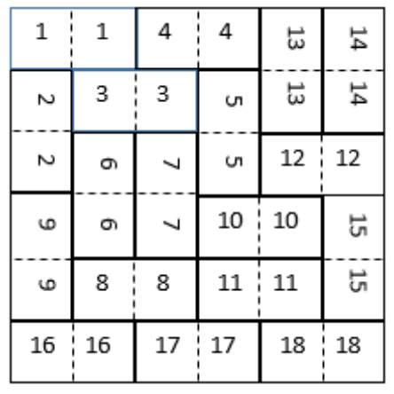

## 문제

A square wall with size N × N is build up by N2/2 bricks, all close fitting to each other (N is an even number). Each brick has size 2 × 1. The bricks are numbered from 1 to N2/2. A part of the bricks are positioned horizontally and the rest of the bricks are positioned vertically. There are no holes in the wall. On the example given below, each pair of squares with same numbers in both squares represents one brick.

We need to make a rectangular hole in the wall in order to fit a window. The hole must meet the following requirements:

1. Its borders should be parallel to the borders of the wall;
2. The hole must not touch any of the borders of the wall (means the hole must be totally “inside” the wall);
3. When making the hole, no brick should be broken (so the borders of the hole must pass only on borders of the bricks).

Write program hole which determines the rectangular hole with maximum area, which meets the given requirements.

## 입력

A single positive integer N is given on the first row of the standard input – size of wall’s side. Following are N rows with N integers in each one, which describes the brick configuration of the wall.

## 출력

On a single row of the standard output the program has to print five integers separated by single intervals – area, row and column number of the upper-left corner and row and column number of the bottom-right corner of the found rectangle (we assume that the upper-left position of the entire wall has coordinates (1,1)). If more than one solution exists, the program has to output only one solution, which may be any possible.

## 힌트

The maximum rectangular hole has area 8. It is possible to make it by removing bricks with numbers 3, 6, 7 and 8.
