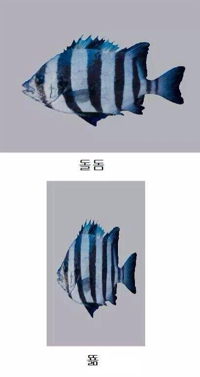

## 문제

정우는 "뚊"과 "돌돔"을 의미하는 두 이미지를 받았다. 과연 두 그림이 같은지 검사해보자. 즉 N× M 크기의 이미지와 N ×2 M 크기의 이미지가 주어질 때 첫 번째 이미지를 가로로 두 배로 늘이면 두 번째 이미지가 되는지 검사하는 프로그램을 작성하라.

## 입력

입력의 첫 번째 줄에 N, M (1 ≤ N, M ≤ 10)이 주어진다. 다음 N개의 줄의 각 줄에는 M개의 문자가 주어진다. 다음 N개의 줄의 각 줄에는 2M개의 문자가 주어진다. 모든 문자는 영문 알파벳 대문자 혹은 소문자이다.

## 출력

첫 번째로 주어진 이미지를 가로로 두 배로 늘렸을 때 두 번째 이미지가 된다면 "Eyfa"을 출력하고, 되지 않는다면 "Not Eyfa"을 출력한다.
