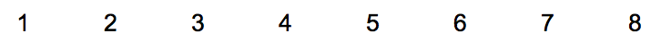
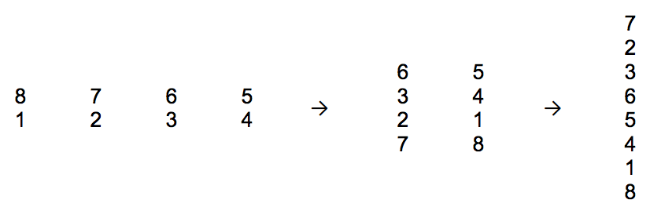

## 문제

Let K be some positive integer. We have a paper stripe with N=2K cells. Cells are numbered left to right with numbers from 1 to N. Here is how the stripe looks like initially (this is a side view, not a top view!) for K=3, and correspondingly, N=8:

We can fold the stripe in the following way: stripe is marked in its center and, keeping one half not touched, fold the other up or down. First, we fold right half up. Then, we fold left half down, and finally, we fold left half up. This is how sample stripe will look like after each move:

As we see, numbers on the stripe from top to bottom stand in the following order: 7, 2, 3, 6, 5, 4, 1, 8.

This is what we need to find. K in this task is fixed and equals 21. So we have a stripe with 221 cells; this stripe is folded 21 times, according to a sequence of folding instructions: LU (we bind left half up), LD (we bind left half down), RU (we bind right half up) or RD (we bind right half down). We need to determine the order of the numbers on the folded stripe. More exactly, we need to know 1024 numbers – they should appear on output.

## 입력

Input file contains the folding instructions and consists of 21 lines – each line contains two symbols: LU, LD, RU, or RD. The M-th line contains the description of the M-th (1≤M≤21) fold.

## 출력

Output consists of exactly 1024 lines. The M-th line (1≤M≤1024) contains the M-th number from top.

Sample data are too big to show on paper, but if K=3 and you have to output the first 5 numbers, the output is the following:
