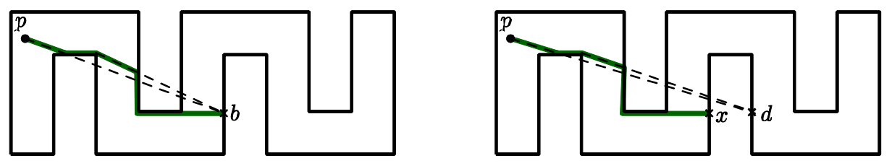

## 문제

A farmer Will has a plan to purchase a robot management system for his farm. The system operates multiple autonomous robots in the farm to collect the useful information. To control the robots, the system has a server, called beacon, at a fixed position in the farm. At the end of day, the robots should be returned to the beacon, and checked their status for the next day. For this, the beacon keeps sending a special signal to the robots. The robots immediately know from the signal where the beacon is, and try to reach the beacon by moving continuously toward the beacon.

More precisely, the farm is modeled as a simple rectilinear polygon P such that horizontal and vertical edges appear alternatingly along its boundary, its vertices are all distinct, and two edges have no intersections except at their end vertices. A robot as well as a beacon is represented as a point in P, that is, on the boundary of P or in the interior of P. A robot p now moves in P greedily to minimize its Euclidean distance to the beacon b as follows: p moves along the ray from p to b until it reaches b or hits the boundary of P. If it hits the boundary, then it may either still reduce its Euclidean distance to b by sliding on the boundary, or it cannot reduce the distance even to any direction. A point p in P is attracted by b in P (equivalently, b attracts p) if it eventually reaches to b in P by strictly decreasing its Euclidean distance to b.

Let us look at the Figure 1 below. In the left figure, a point p can move along the path marked with thick solid segments, and finally reach to the beacon b. In the right figure, it can reach to x, but it cannot move anymore because there is no direction from x to reduce its Euclidean distance to b.

Figure 1. The cases where a beacon Acan or cannot attract a point B.

A kernel of P is the set of points in P that can attract all points in P. If a beacon is placed at any position of the kernel of P, then all points in P can be attracted by the beacon, so only one beacon is sufficient to call all the robots. But the kernel of some polygon may not exist.

Given a simple rectilinear polygon P of n vertices, write a program to decide whether its kernel exists or not.

## 입력

Your program is to read from standard input. The input consists of T test cases. The number of test cases T is given in the first line of the input. Each test case starts with a line containing an integer, n (4 ≤ n ≤ 10,000), where n is the number of vertices in a simple rectilinear polygon P. The following n lines give the coordinates of the vertices in counterclockwise direction. Each vertex is represented by two numbers separated by a single space, which are the x-coordinate and the y-coordinate of the vertex, respectively. Each coordinate is given as an integer between −1,000,000,000 and 1,000,000,000, inclusively. Note that all the vertices are distinct.

## 출력

Your program is to write to standard output. Print exactly one line for each test case. The line should contain YES if the polygon given in the test case has a kernel, NO otherwise.
