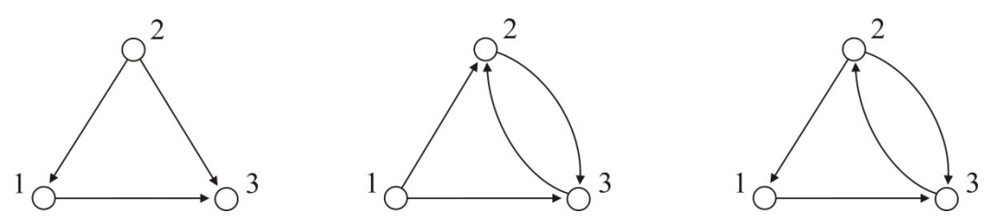

## 문제

최근에 유능한 학생 홍준이는 일반적인 무방향성 그래프에서는 어려운 문제 몇 개가 홀수 싸이클이 없을 경우 다항 시간안에 해결되는 것을 알게 되었다. 방향성 그래프에서 같은지도 확인하기 위해 그의 지도교수 백준과 함께 관련 연구를 하기로 했다. 연구의 첫 목표는 방향성 그래프에서 홀수 싸이클이 있는지 확인하는 것이다. 홍준이가 찾은 알고리즘은 연구실에서 성능이 좋기로 인정을 받지만, 더욱 더 효율 좋은 알고리즘을 찾고 싶어한다. 그를 도와 아주 아주 성능좋은 방향성 그래프에서 홀수 싸이클을 찾는 알고리즘을 찾자. 홀수 싸이클이 존재한다면 존재 유무 뿐만아니라 싸이클이 "어떤" 싸이클이 존재하는지도 찾아내자.

G를 자기 루프와 중복 간선 없는 단순 방향성 그래프라고 하자. 어떤 두 정점 v, w가 G에 있다고 할 때, v에서 w로 가는 경로를 (u1, u2, … ,ul)라 하자. 이때, ui들은 서로 다르고, u1 = v, ul = w이고, 1이상 l 미만인 모든 i에 대해 ui에서 ui+1로 가는 방향성 간선이 존재한다. 만약 l ≥ 2이고 ul에서 u1으로 가는 방향성 간선이 존재한다면, 이를 싸이클이라고 한다. 홀수 싸이클이란 싸이클 중에서 길이 l이 홀수인 싸이클을 의미한다. 아래 <그림 1>을 참고하자.

  
<그림 1> 단순 방향성 그래프들

## 입력

입력의 첫 줄에는 테스트케이스 수를 나타내는 자연수 T가 입력으로 주어진다. 이어서 각 테스트케이스마다 첫 줄에는 정점의 개수를 나타내는 자연수 N과 간선의 수를 나타내는 자연수 M이 주어진다. 정점의 번호는 1부터 N까지 매겨져있고, N ≤ 100,000, M ≤ 1,000,000이다. 이후 M개의 줄에는 단순 방향성 그래프의 간선들이 주어진다. 만약 v w가 주어졌다면 v번 정점에서 w번 정점으로 가는 방향성 간선이 있다는 뜻이다.

## 출력

각 테스트케이스에 대해서 홀수 싸이클이 없으면 -1을 출력하고, 있다면 1을 출력한 뒤 싸이클의 크기, 싸이클에 있는 정점 번호들을 방문 순서대로 줄로 구분하여 출력한다. 싸이클에 있는 정점 번호들이 서로 달라야 됨에 유의하자.
