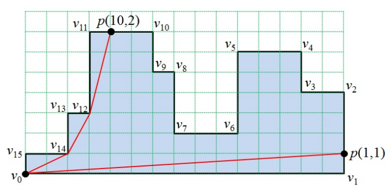

## 문제

A histogram is a simple rectilinear polygon whose boundary consists of two chains such that the upper chain is monotone with respect to the horizontal axis and the lower chain is a horizontal line segment, called the base segment (See Figure 1).

Figure 1. A histogram and its base segment (v0, v1)

Let P be a histogram specified by a list (v0, v1, … ,vn-1) of n vertices in the counterclockwise order along the boundary such that its base segment is (v0, v1). An edge ei is a line segment connecting two vertices vi and vi+1, where i = 0, 1, … , n − 1 and vn = v0.

A path inside P is a simple path which does not intersect the exterior of P. The length of the path is defined as the sum of Euclidean length of the line segments of the path. The distance between two points p and q of P is the length of the shortest path inside P between p and q. Your task is to find the distance between v0 and each point of a given set S of points on the boundary of P. A point of the set S is denoted by p(k, d) which represents a point q on the edge ek such that d is the distance between vk and q.

In the histogram of Figure 1, the shortest path between v0 and q1 = p(10, 2) is a polygonal chain connecting v0, v14, v12 and q1 in that order, and its length is 8.595242. The shortest path between v0 and q2 = p(1, 1) is a segment directly connecting v0 and q2 with length 15.033296.

Given a histogram P with n vertices and a set S of m points on the boundary of P, write a program to find the distances between v0 and all points of S.

## 입력

Your program is to read from standard input. The input consists of T test cases. The number of test cases T is given in the first line of the input. Each test case starts with a line containing an integer, n (4 ≤ n ≤ 100,000), where n is the number of vertices of a histogram P = (v0, v1, … , vn-1). In the following n lines, each of the n vertices of P is given line by line from v0 to vn-1. Each vertex is represented by two numbers, which are the x-coordinate and the y-coordinate of the vertex, respectively. Each coordinate is given as an integer between 0 and 1,000,000, inclusively. Notice that (v0, v1) is the base segment. The next line contains an integer m (1 ≤ m ≤ 100,000) which is the size of a set S given as your task. In the following m lines. Each point p(k,d) of S is given line by line, and is represented by two integers k and d, where 0 ≤ k ≤ n − 1 and 0 ≤ d < the length of edge ek. All points in the set S are distinct.

## 출력

Your program is to write to standard output. Print exactly one line for each test case. The line should contain exactly one real value which is the sum of the distances between v0 and all points of S. Your output must contain the first digit after the decimal point, rounded off from the second digit. If each result is within an error range, 0.1, it will be considered correct. The Euclidean distance between two points p = (x1, y1) and q = (x2, y2) is \(\sqrt{(x\_2 - x\_1)^2 + (y\_2 - y\_1)^2}\)
