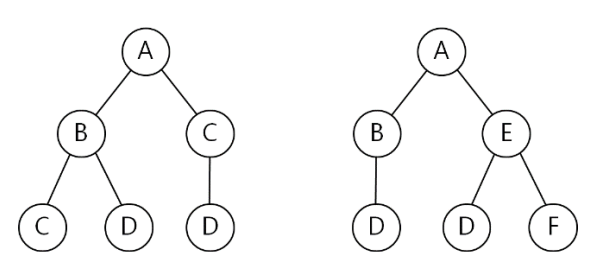

## 문제

XML(eXtensible Mark-up Language) is a markup language that defines a set of rules for encoding documents. XML has come into common use for the interchange of data over the Internet. XML documents represent hierarchically structured data and are generally modeled as ordered labeled trees. Each node in such a tree represents an XML element and is labeled with a corresponding tag name. Each edge in this tree represents a relation between the child element and parent element in the corresponding XML document. Finding structural similarities among XML documents is one of central issues in information retrieval. Here, we consider the structural similarity of two XML documents represented as ordered labeled trees.

Let T be a rooted tree with one or more nodes. We call T a labeled tree if each node is assigned a label. The labels of a labeled tree are not necessarily distinct. We call T an ordered tree if a left-to-right order among siblings in T is given. Given two ordered labeled trees T1 and T2, the similarity of T1 and T2 is often measured by Tree Edit Distance, TED(T1, T2). TED(T1, T2) is defined as the minimum number of edit operations that transform T1 to T2. Three edit operations that can be applied to a given tree T are as follows:

1. Insert(x): Insert a leaf node whose label is x. After this operation, node x becomes an i-th child of its parent for some i, 1 ≤ i ≤ d + 1, if its parent had d children before this operation.
2. Delete( ): Delete an arbitrary leaf node. This operation cannot be applied to a tree with a single node.
3. Relabel(x, y): Replace the label x of an arbitrary node by the label y.

Note that only one node is inserted, deleted, or relabeled by one edit operation. For example, let’s consider two trees in Figure 1. If we apply the following three operations successively, then T1 transforms to T2 : Delete( ), Relabel(C,E), and Insert(F), where the delete operation is applied to a leaf node C in T1. By applying two or less operations, you cannot transform T1 to T2. So, TED(T1, T2) is 3.

(a) T1  (b) T2

Figure 1. Two ordered labeled trees

You are to write a program calculating the tree edit distance of given two ordered labeled trees.

## 입력

Your program is to read from standard input. The input consists of T test cases. The number of test cases T is given in the first line of the input. Each test case consists of two lines. The first line contains a string representing T1 and the second line contains a string representing T2. The representation of a tree is as follows: a tree consisting of a single root node with a label l is represented as (l); a tree consisting of a root labeled l with subtrees T1, T2, … ,Td, is represented as (l(r1)(r2)⋯(rd)), where (r1), (r2), … , (rd) are representations of T1, T2, … ,Td, respectively. Each label of nodes is given as one uppercase character in the English alphabet. In the representation of a tree, there are no spaces and the number of nodes is between 1 and 1,000, inclusively.

## 출력

Your program is to write to standard output. Print exactly one line for each test case. The line should contain the minimum number of edit operations to transform T1 into T2.
