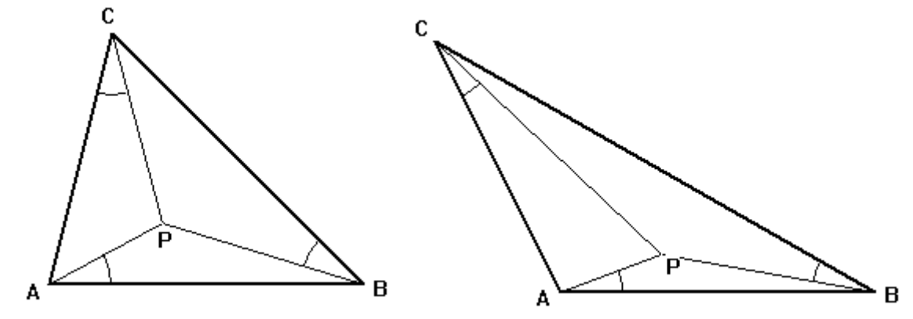

## 문제

The Brocard point of a triangle ABC is a point P in the triangle chosen so that: ∠PAB = ∠PBC = ∠PCA (see figure below).

The common angle is called the Brocard angle. The largest Brocard angle is π/6 which is the Brocard angle for an equilateral triangle (the Brocard point is the centroid of the triangle).

Write a program to compute the coordinates of the Brocard point of a triangle given the coordinates of the vertices.

## 입력

The first line of input contains a single integer P, (1 ≤ P ≤ 10000), which is the number of data sets that follow. Each data set should be processed identically and independently.

Each data set consists of a single line of input. It contains the data set number, K, followed by the six space separated coordinate values Ax, Ay, Bx, By, Cx, Cy of the vertices of the triangle. The vertices will always be specified so going from A to B to C and back to A circles the triangle counter-clockwise. Input coordinates are floating point values.

## 출력

For each data set there is a single line of output. The single output line consists of the data set number, K, followed by a single space followed by the x coordinate of the Brocard point, followed by a single space followed by the y coordinate of the Brocard point. Coordinates should be rounded to five decimal places.
