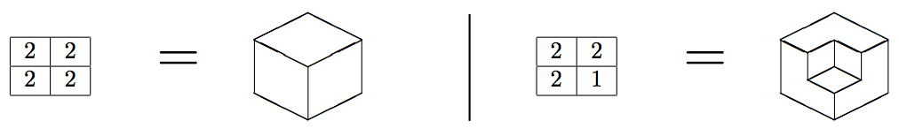
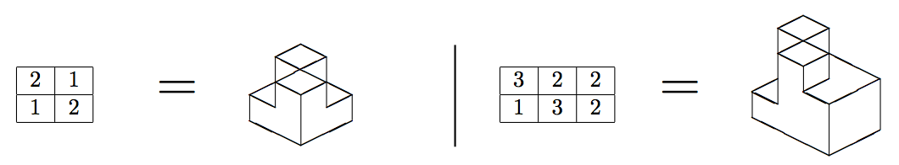

## 문제

A height map is a two-dimensional matrix of positive integers that represents a polyhedron. Each cell of the matrix with value V represents a parallelepiped shaped column of 1 × 1 × V that is laid on one of its 1 × 1 faces onto the cell. This creates a polyhedron with a single face in the bottom made up of all the downwards facing 1×1 faces combined, and possibly several faces on the top and on the sides.

For instance, a 2 × 2 matrix with all values equal to 2 represents a cube of side 2. However, if one of the values is 1, the represented polyhedron is the same cube with one corner cut off. The following picture represents both alternatives.

While not every polyhedron can be represented in this fashion, there are several that can. Here are a couple of other examples.

Given a height map, you are asked to count the number of faces of the represented polyhedron. Notice that a face is defined as a simple polygon that describes a contiguous and maximal boundary of the polyhedron. As you can see in the last two examples, it is possible for two different coplanar faces to share a common vertex, or even a side, or portions of a side.

## 입력

The first line contains two integers R and C, representing respectively the number of rows and columns of the height map (1 ≤ R, C ≤ 100). Each of the next R lines contains C integers; the j-th integer in the i-th line is the value Vi,j located in the i-th row and j-th column of the matrix (1 ≤ Vi,j ≤ 109 for i = 1, 2, . . . , R and j = 1, 2, . . . , C).

## 출력

Output a line with an integer representing the number of faces of the polyhedron represented by the input height map.
