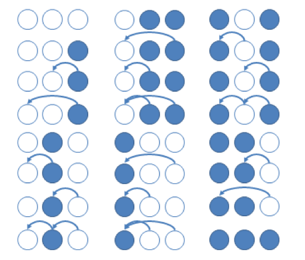

## 문제

N (1 ≤ N ≤ 100)개의 정점의 개수가 주어지고, K (1 ≤ K ≤ 3)개의 가능한 색깔이 주어진다. 각 정점들을 1 부터 N까지 차례로 번호를 매기고, 그 정점들에 K개의 색깔중 하나를 임의로 부여한다.

그 다음, 정점들 사이에 간선을 추가하는데 다음과 같은 규칙을 만족해야 한다.

* 1 ≤ j < i ≤ N일 때, 정점 i와 정점 j의 색깔이 다르다면 i에서 j로 향하는 간선을 추가할 수 있고, 추가하지 않아도 무방하다.
* 임의의 정점 i (2 ≤ i ≤ N)에 대해 정점 i에서 다른 정점으로 향하는 간선은 최대 1개만 있을 수 있다. (즉, 정점 i의 out-degree 가 최대 1이다.)

두 그래프는 정점에 부여된 색깔과, 정점 사이에 이어진 간선이 동일할 때 동일하다고 간주된다. 예를 들어, N=3, K=2 인경우 아래와 같이 24개의 서로 다른 그래프가 가능하다.

N, K가 주어질 때, 서로 다른 그래프의 경우의 수를 1,000,000,007 나눈 나머지를 출력하시오.

## 입력

정점의 개수인 정수 N (1 ≤ N ≤ 100)과 가능한 색의 개수인 정수 K (1 ≤ K ≤ 3)가 한 줄에 공백 한 개로 구분되어 주어진다

## 출력

가능한 그래프의 조합의 개수를 1,000,000,007 로 나눈 나머지를 출력한다.
