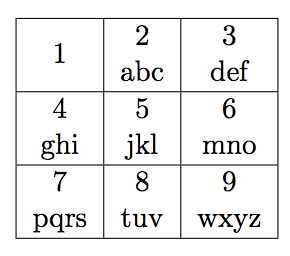

## 문제

Good old Marko came across a new feature on his mobile phone – T9 input! His phone has a keyboard consisting of numbers looking like this:

In order to input a word using this keyboard, one needs to press a key multiple times for the required letter. More specifically, if the required letter is the first letter mapped to the key, one key press is needed, if it’s the second, two key presses are needed and so on. For instance, if we want to input the word “giht”, we will press the following keys: g-4 i-444 h-44 t-8. The new possibility Marko discovered enables you to input text more easily because you don’t need several presses per letter anymore, just one. The software will try to figure out what word from the dictionary you are trying to input.

Marko is quite sceptical of new technologies (at least new for him) and he is afraid that errors will be frequent. That is the reason why he decided to test his hypothesis that the errors are frequent. Marko knows by heart the whole dictionary in the mobile phone. The dictionary consists of N words consisting of lowercase letters from the English alphabet, the total length of the word not exceeding 1 000 000 characters. He will give an array of key presses S, of total length at most 1 000, and wants to know how many words from the dictionary can be mapped to the given array of key presses if the T9 input feature is used.

## 입력

The first line of input contains the integer N, the number of words in the dictionary. (1 ≤ N ≤ 1 000). Each of the following N lines contains a single word. The last line of input contains the string S (1 ≤ |S| ≤ 1000) consisting of digits 2-9.

## 출력

The first and only line of output must contain the number of words from the dictionary possible to construct from the letters on the keys determined by the string S.

## 힌트

Clarification of the first example: “mono” is the only word that has all the letters located on key 6.

Clarification of the second example: The first letter of both words is located on key 5 and the second letter of both words is located on key 2.
