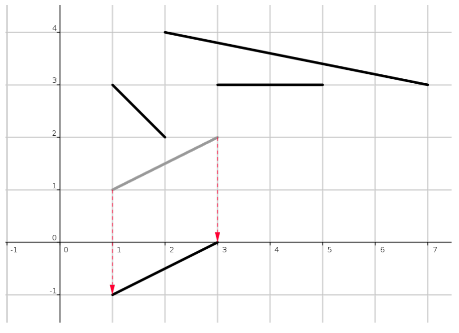

## 문제

You have most definitely heard the legend of King Arthur and the Knights of the Round Table. Almost all versions of this story proudly point out that the roundness of the Round Table is closely related to Arthur’s belief of equality among the Knights. That is a lie! In fact, Arthur’s choice of table is conditioned by his childhood traumas.

In fact, Arthur was forced to clean up quadratic tables from a young age after a tournament in pick-up sticks1 had been played on them. After the tournament, typically there would be a bunch of sticks on the table that do not touch each other. In the spirit of the game, the organizers issued strict regulations for the table cleaners. More precisely, the sticks on the table need to be removed one by one in a way that the cleaners pull them in the shortest way towards the edge of the table closest to where they are currently sitting. They also mustn’t rotate or touch the other sticks while doing this (not even in the edge points).

In this task, we will represent the table in the coordinate system with a square that has opposite points in the coordinates (0,0) and (10 000, 10 000), whereas the sticks will be represented with straight line segments that lie within that square. We will assume that Arthur is sitting at the edge of the table lying on the x-axis. Then the movement of the stick comes down to translating the line segment along the shortest path towards the x-axis until the stick falls off the table (as shown in the image). It is your task to help Arthur determine the order of stick movements that meets the requirements from the previous paragraph.

1A game that involves carefully moving sticks.

## 입력

The first line of input contains the integer N (1 ≤ N ≤ 5 000), the number of sticks on the table. Each of the following N lines contains four integers x1, y1, x2, y2 (0 ≤ x1, y1, x2, y2 ≤ 10 000) that denote the edge points of a stick.

## 출력

The first and only line of output must contain space-separated stick labels in the order which they need to be taken off the table. A stick’s label corresponds to its position in the input sequence.

If there are multiple possible solutions, output any of them.

## 힌트

Clarification of the first example: The example corresponds to the image from the task. Another possible solution is 2 1 4 3.
