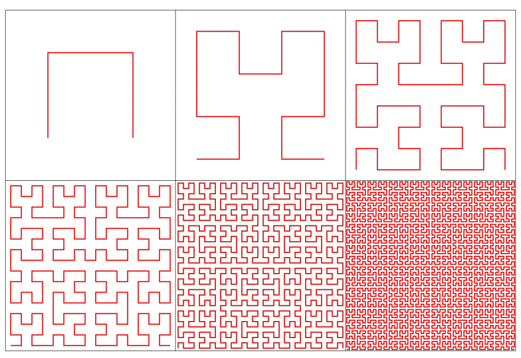

## 문제

In database storage, arranging data items according to a numeric key not only makes it easier to search for a particular item, but also makes better use of a CPU’s cache: any segment of data that’s contiguous in memory will describe items with similar keys. This is useful if, for instance, we want to access all items whose keys are in some range. Things get more complicated if the keys represent points on a 2D grid, as might happen in a GPS guidance system. If the points (x, y) are sorted primarily by x, breaking ties by y, then points that are adjacent in memory will have similar x coordinates but not necessarily similar y, potentially placing them far apart on the grid. To better preserve distances, we may sort the data along a continuous space-filling curve.

We consider one such space-filling curve called the Hilbert curve. The Hilbert curve starts at the origin (0, 0) and finishes at (S, 0), in the process traversing the entire axis-aligned square with corners at (0, 0) and (S, S). It has the following recursive construction: split the square into four quadrants meeting at (S/2, S/2), and recursively fill each of them with a suitably rotated and scaled copy of the full Hilbert curve. First, the lower-left quadrant is filled with a curve going from (0, 0) to (0, S/2). Second, the upper-left quadrant is filled from (0, S/2) to (S/2, S/2). Third, the upperright quadrant is filled from (S/2, S/2) to (S, S/2). And finally, the lower-right quadrant is filled from (S, S/2) to (S, 0). The Hilbert curve can alternatively be constructed as the mathematical limit of a sequence of curves, the first six of which are shown in the figure.

Given some locations of interest, you are asked to sort them according to when the Hilbert curve visits them. Note that while the curve intersects itself at infinitely many places, e.g., at (S/2, S/2); making S odd guarantees that all integer points are visited just once.

## 입력

The first line of input contains two space-separated integers n and S (1 ≤ n ≤ 200,000, 1 ≤ S < 109 , S is odd). This is followed by n lines. Line i + 1 describes the ith location of interest by spaceseparated integers xi and yi (0 ≤ xi, yi ≤ S) and an identifier string consisting of at most 46 alphanumeric characters (‘A’–‘Z’, ‘a’–‘z’, ‘0’–‘9’). No two locations will share the same position or the same identifier.

## 출력

Print the n identifier strings, one on each line, Hilbert-sorted according to their positions.
