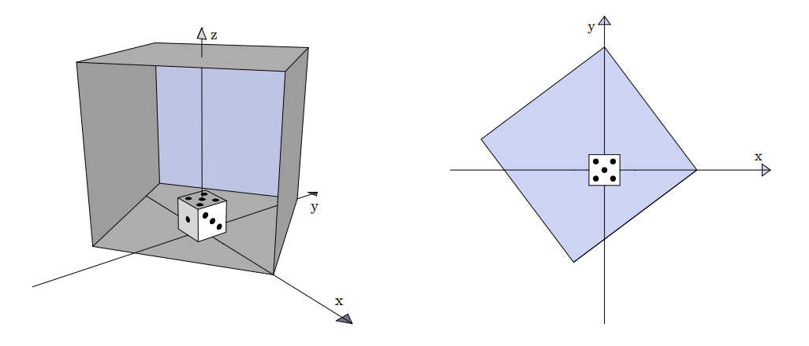

## 문제

You have managed to trap a hornet inside a box lying on the top of your dining table. Unfortunately, your playing dice is also trapped inside – you cannot retrieve it and continue your game of Monopoly without risking the hornet’s wrath. Instead, you pass your time calculating the expected number of spots on the dice visible to the hornet.

The hornet, the dice and the box are located in the standard three-dimensional coordinate system with the x coordinate growing eastwards, the y coordinate growing northwards and the z coordinate growing upwards. The surface of the table corresponds to the x-y plane.

Perspective and the birds-eye view of the second example input

The dice is a 1 × 1 × 1 cube, resting on the table with the center of the bottom side exactly in the origin. Hence, the coordinates of its two opposite corners are (−0.5, −0.5, 0) and (0.5, 0.5, 1). The top side of the dice has 5 spots, the south side 1 spot, the east side 3 spots, the north side 6 spots, the west side 4 spots and the (invisible and irrelevant) bottom side 2 spots.

The box is a 5 × 5 × 5 cube also resting on the table with the dice in its interior. The box is specified by giving the coordinates of its bottom side – a 5 × 5 square.

Assume the hornet is hovering at a uniformly random point in the (continuous) space inside the box not occupied by the dice. Calculate the expected number of spots visible by the hornet. The dice is opaque and, hence, the hornet sees a spot only if the segment connecting the center of the spot and the location of the hornet does not intersect the interior of the dice.

## 입력

Input consists of 4 lines. The k-th line contains two floating-point numbers xk and yk (−5 ≤ xk, yk ≤ 5) – coordinates of the k-th corner of the bottom side of the box in the x-y plane. The coordinates are given in the counterclockwise direction and they describe a square with the side length of exactly 5.

The box fully contains the dice. The surfaces of the box and the dice do not intersect or touch except along the bottom sides.

## 출력

Output a single floating point number – the expected number of spots visible. The solution will be accepted if the absolute or the relative difference from the judges solution is less than 10−6.
