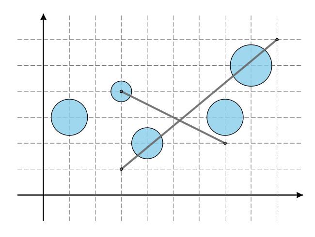

## 문제

A fishing village built on the surface of a frozen lake far north in the arctic is endangered by global warming – fractures are starting to form on the lake surface. The village consists of n igloos of spherical shape, each occupying a circular area of the surface.

An igloo can be represented as a circle in the coordinate plane: the center of the circle is a point with integer coordinates, while the radius is a positive floating-point number less than 1 with exactly one fractional digit.

Given the locations of possible ice fractures, the villagers would like to know how many igloos are affected by each. Formally, given q queries where each query is a straight line segment defined by the two endpoints, find the number of igloos each segment intersects. A segment intersects an igloo if it has at least one point in common with the interior of the circle.

## 입력

The first line contains an integer n (1 ≤ n ≤ 100 000) - the number of igloos. Each of the following n lines contains three numbers x, y and r – the coordinates of the center and the radius of one igloo. The coordinates x and y are integers such that 1 ≤ x, y ≤ 500, while r is a floating-point number with exactly one fractional digit such that 0 < r < 1. No two igloos will intersect or touch.

The following line contains an integer q (1 ≤ q ≤ 100 000) - the number of queries. Each of the following q lines contains four integers x1, y1, x2, y2 (1 ≤ x1, y1, x2, y2 ≤ 500) - the coordinates of the two endpoints of the segment. The two endpoints will be different. Endpoints may be inside igloos.

You may assume that, for every igloo i and the segment s, the square of the distance between s and the center of i is either less than r2 − 10−5 or greater than r2 + 10−5 where r is the radius of the igloo i.

## 출력

Output should consist of q lines. The k-th line should contain a single integer – the number of igloos that are intersected by the k-th segment.

## 힌트

