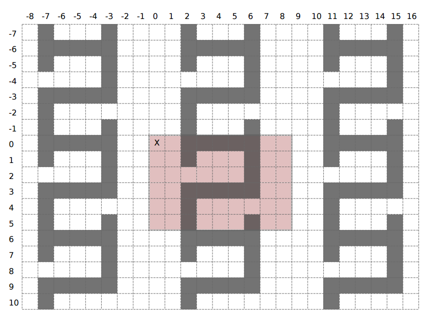

## 문제

A labyrinth is obtained by tiling the entire plane with a pattern – a rectangular grid consisting of n rows and m columns where every cell is either empty or blocked. The result is an infinite grid of cells with the pattern repeating in all four directions.

Formally, suppose we denote both rows and columns of the infinite grid with integers (including the negative integers). The row number increases as we move downwards in the grid, while the column number increases as we go to the right. The cell at coordinates (0, 0) is called the origin. The labyrinth is obtained by copying the pattern (without mirroring or rotation) to every n-by-m rectangular area that, in the upper-left corner, has a cell with the row number divisible by n and the column number divisible by m. In particular, the upper-left corner of the pattern gets copied to the origin, while the lower-right corner gets copied to the cell with coordinates (n − 1, m − 1).

To escape the labyrinth starting from a particular cell, we need to reach the origin via a sequence of empty cells, going up, down, left or right in each step.

You are given a pattern and a sequence of possible starting cells. For each starting cell determine if it is possible to escape the labyrinth.

## 입력

The first line contains two integers n and m (1 ≤ n, m ≤ 100) – the number of rows and columns in the pattern, respectively. Each of the following n lines contains a string of exactly m characters describing one row of the pattern. The character # denotes a blocked cell while the dot character denotes an empty cell.

The following line contains an integer q (1 ≤ q ≤ 200, 000) – the number of starting cells. The k-th of the following q lines contains two integers r and c (−109 ≤ r, c ≤ 109) – the row and column of the k-th starting cell.

The origin and all starting cells will be empty

## 출력

Output should consist of q lines. The k-th line should contain the word yes if it is possible to exit the labyrinth from the k-th starting cell and the word no otherwise.

## 힌트

