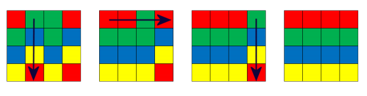

## 문제

You are given a puzzle that can be represented as a 4 × 4 grid of colored cells. The solved puzzle contains 4 monochromatic rows, in this order: red, green, blue, yellow. Although we will analyze this puzzle using its 2D representation, it is actually a 3D puzzle! Imagine that the grid is stretched over a torus (in other words, top edge is connected to the bottom one and left edge is connected to the right one). If you are not familiar with the word “torus” or what it is supposed to represent, just replace it with the word(s) “donut (with the hole in the middle)”.

For each move you are allowed to either move one row left or right, or one column up or down. The fact that the outer edges are connected means that if a cell is “pushed out” of the grid, it will reappear on the other side of the grid. If you had a torus or a donut handy (or a cup! HAHAha...ha... <sniff>), this would be much clearer.

Given a description of a state of this puzzle, what is the minimum number of moves you need to solve it? Note that all possible puzzle configurations are solvable in less than 13 moves.

## 입력

Input file contains exactly 4 lines, containing 4 characters each, each character being either “R”, “G”, “B” or “Y’. The input will describe a valid state of the puzzle.

## 출력

Output the minimum number of moves needed to solve the given puzzle.
