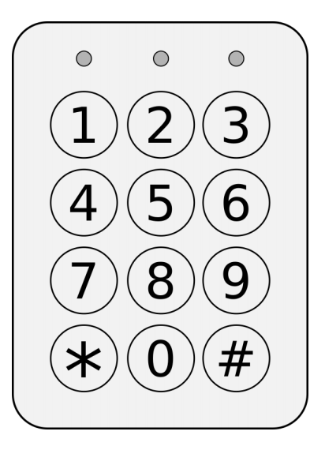

## 문제

A matrix keypad consists of an r × c grid of buttons. Additionally, there is one wire for each row and one wire for each column. These wires are exposed through pins so the keypad can be connected to a larger circuit.

When a button at row i and column j is pressed, the wire for row i and the wire for column j will carry an electrical current. If just a single button is pressed, it can be identified by sequentially checking if a current can be detected at each row wire and at each column wire.

Unfortunately, when multiple buttons are pressed at the same time, it may not be possible to uniquely identify which buttons are pressed. The only information you can have is this: for each wire, whether there is at least one button along that wire being pressed.

The software you are using to detect which buttons are pressed was poorly implemented. After probing the keypad, it stores the information in an r × c grid of 0/1 values. The value stored in row i and column j of this grid is 1 if there is at least one button in row i and at least one (possibly different) button in column j that is pressed. Otherwise, the value that is stored at this position is 0.

Your job is to interpret as much information from such a grid as possible. Determine which buttons are definitely pressed and which buttons are definitely not pressed.

## 입력

The first line of input contains a single positive integer T ≤ 200 indicating the number of test cases. The first line of each test case contains two integers r and c where 1 ≤ r ≤ 10 and 1 ≤ c ≤ 10. This indicates that the keypad is an r × c grid of buttons.

The remaining r lines of a test case describe the grid. The ith row contains a string of consecutive 0 and 1 characters. These will not be separated by spaces.

## 출력

For each test case, output the following. If there is no combination of button presses on the keypad that would produce this 0/1 grid then simply output a line containing the word impossible

Otherwise, you should output r lines, each containing a string of length c. This should describe a grid where the character at row i and column j is:

* N if no button combination that produces the input grid has the jth button on row i being pressed.
* P if all button combinations that produce the input grid have the jth button on row i being pressed.
* I if some, but not all, button combinations that produce the input grid have the jth button on row i being pressed.

Finally, the last line of each test case should be followed by the string ---------- (10 dashes).
