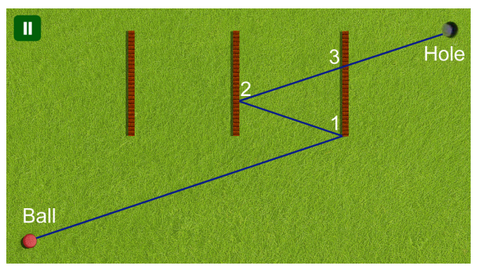

## 문제

Janine recently went to her local game store and bought “Hole in One”, a new mini-golf game for her computer. As indicated by the name, the objective of the game is to shoot a ball into a hole using just one shot. The game also borrows elements from brick breaker style games: in the playing field, several walls are placed that will be destroyed upon being hit by the ball. The score of a successful shot depends on the number of destroyed walls, so Janine wonders: what is the maximum number of walls that can be hit while performing a “Hole in One”?

For the purposes of this problem you can think of the playing field as a cartesian plane with the initial position of the ball at the origin. The walls are non-intersecting axis-parallel line segments in this plane (i.e., parallel to either the x axis or the y axis). The diameter of the ball is negligible so it is represented as a single point.

Figure H.1: Illustration of the first sample input: The ball first bounces off two walls at points 1 and 2. When it passes point 3 the wall has already vanished.

Whenever the ball hits a wall, two things happen:

* The direction of the ball changes in the usual way: the angle of incidence equals the angle of reflection.
* The wall that the ball touched is destroyed. Following common video game logic, no rubble of the wall remains; it will be as though it vanished.

The behaviour of the ball is also affected by the power of the shot. In particular, an optimal shot may need to first roll over the hole, then hit some more walls, and only later drop into the hole.

## 입력

The input consists of:

* one line with one integer n (0 ≤ n ≤ 8), the number of walls;
* one line with two integers x and y, the coordinates of the hole;
* n lines each with four integers x1, y1, x2, and y2 (either x1 = x2, or y1 = y2, but not both), representing a wall with end points (x1, y1) and (x2, y2).

The hole is not at the origin and not on a wall. The walls do not touch or intersect each other. No wall lies completely on the x axis or the y axis. All coordinates in the input are integers with absolute value at most 1 000.

## 출력

If there is no way to shoot the ball such that it reaches the hole, print “impossible”. Otherwise, print the maximum number of walls that can be destroyed in a single “Hole in One” shot.
