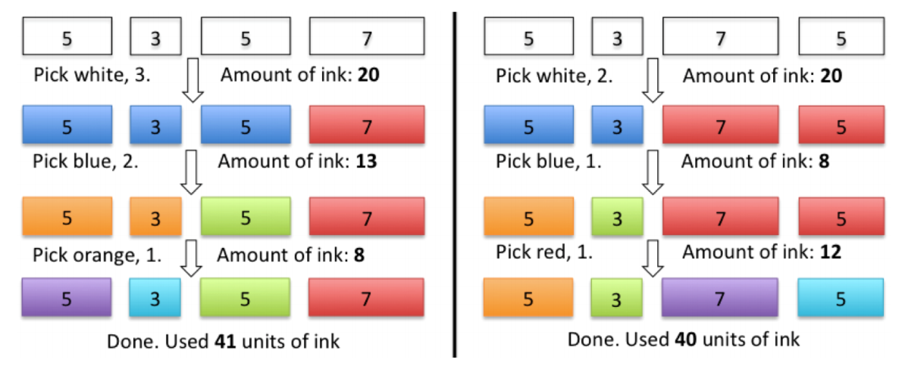

## 문제

After last year’s success, Samuel W. E. R. Craft’s fame continues to grow and now he has funds for all kinds of projects that cross his mind. His newest idea involves creating arrays of canvasses with color patterns having no repeated colors.

Samuel bought a set of white canvasses of varying sizes. Since painting them manually would take too much time, he devised a huge machine to automate the painting process. The painting process works as follows:

1. Assemble all canvasses in a line in the machine’s conveyor belt, disposed in some chosen order.
2. Pick a color C and a number F (which should be less than the number of color C canvasses).
3. Going from left to right, all canvasses with color C are painted. The first F color C canvasses are painted with a new color X and the remaining color C canvasses are painted with a new color Y . Colors X and Y are selected by the machine, are distinct, and are different from any color used previously. The amount of ink spent in this step is equal to the sum of the sizes of the painted canvasses.
4. Repeat 2) and 3) until all canvasses have distinct colors.

Consider for example that Samuel bought four canvasses of sizes 3, 5, 5 and 7. The following picture shows 2 different options for painting them.

Given the sizes of the canvasses Samuel bought, can you help Samuel finding the minimum amount of ink the machine needs to spend in order to have all canvasses with different colors?

## 입력

The first line consists of a single integer T, the number of test cases. Each test case is composed by two lines. The first line consists of a single integer N representing the number of canvasses. The next line contains N space separated integers representing the sizes of the canvasses.

## 출력

The output contains T lines, one for each test case: the minimum amount of ink the machine needs in order to have all canvasses with different colors.
