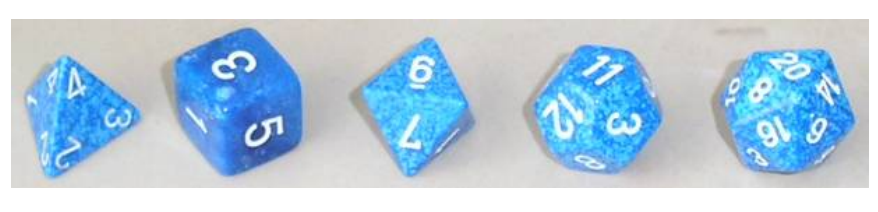

## 문제

In many table-top games it is common to use different dice to simulate random events. A “d” or “D” is used to indicate a die with a specific number of faces, d4 indicating a foursided die, for example. If several dice of the same type are to be rolled, this is indicated by a leading number specifying the number of dice. Hence, 2d6 means the player should roll two six-sided dice and sum the result face values.

Write a program to compute the most likely outcomes for the sum of two dice rolls. Assume each die has numbered faces starting at 1 and that each face has equal roll probability.

## 입력

The input consists of a single line with two integer numbers, N, M, specifying the number of faces of the two dice.

## 출력

A line with the most likely outcome for the sum; in case of several outcomes with the same probability, they must be listed from lowest to highest value in separate lines.
