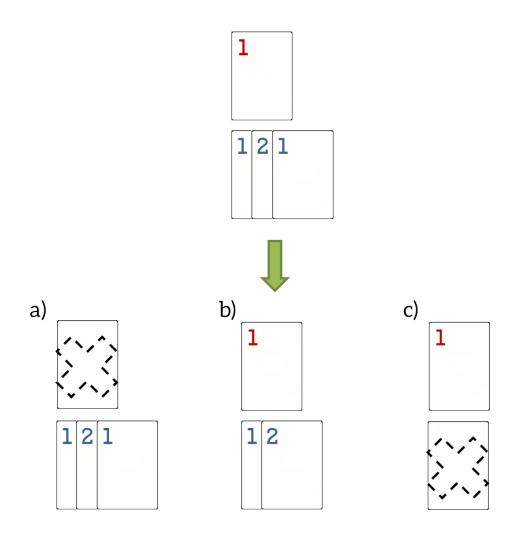

## 문제

Alice and Bob created a new game while at the beach this summer. All they need is a set of numbered playing cards. They start by creating P piles with all cards faceup and select a non-negative number K. After that, they take turns like this:

1. A player starts by selecting one of the piles.
2. Then, he removes from 0 up to K cards from the top of that pile, leaving at least one card in the pile.
3. Next, he looks at the card left at the top of the pile and must remove a number of cards equal to its value (from the top of the same pile).

Whoever doesn’t have more cards to remove, or whoever is forced to remove more cards than those available on a pile, loses the game.

In the figure, you can see an example with two piles and K = 1. The player to move might:

1. Select the first pile and 0 cards to remove, being forced to remove 1 card from the top next.
2. Select the second pile and 0 cards to remove, having to remove 1 card from the top next.
3. Select the second pile and 1 card to remove, having to remove 2 cards from the top next.

Alice has realized that Bob is very good at this game and will always win if he has the chance. Luckily, this time Alice is first to play. Is Alice able to win this game?

Given the description of the piles with all the cards and the maximum number of cards they can start to remove, your goal is to find out whether Alice can win the game if she is the first to play.

## 입력

The first line contains 2 space separated integers, P, the number of piles, and K, the maximum number of cards they can start to remove on their turn. The next P lines start with an integer N, indicating the number of cards on a pile. N space separated integers follow, representing the cards on that pile from the bottom to the top.

## 출력

A single string, stating “Alice can win.” or “Bob will win.”, as appropriate.
