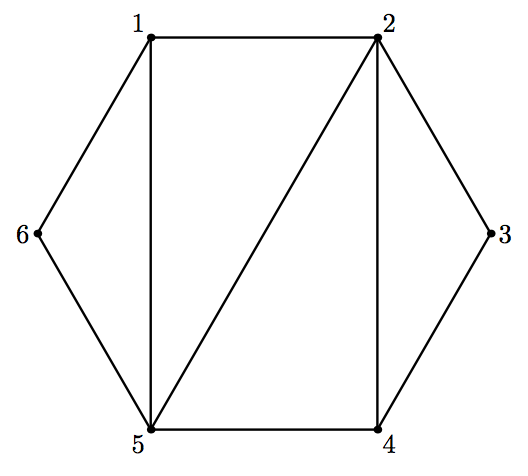

## 문제

You have a convex polygon. The vertices of the polygon are successively numbered from 1 to n. You also have a triangulation of this polygon, given as a list of n − 3 diagonals.

You are also given q queries. Each query consists of two vertex indices. For each query, find the shortest distance between these two vertices, provided that you can move by the sides and by the given diagonals of the polygon, and the distance is measured as the total number of sides and diagonals you have traversed.

## 입력

The first line of the input file contains an integer n — the number of vertices of the polygon (4 ≤ n ≤ 50 000).

Each of the following n−3 lines contains two integers ai, bi — the ends of the i-th diagonal (1 ≤ ai, bi ≤ n, ai ≠ bi).

The next line contains an integer q — the number of queries (1 ≤ q ≤ 100 000).

Each of the following q lines contains two integers xi, yi — the vertices in the i-th query (1 ≤ xi, yi ≤ n).

It is guaranteed that no diagonal coincides with a side of the polygon, and that no two diagonals coincide or intersect.

## 출력

For each query output a line containing the shortest distance.

## 힌트

This is the polygon from the sample input.

