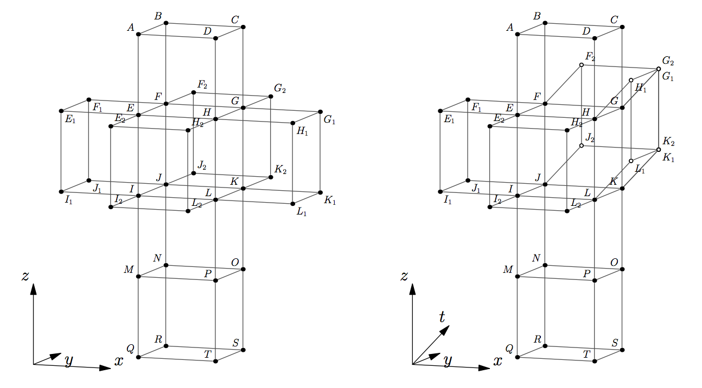
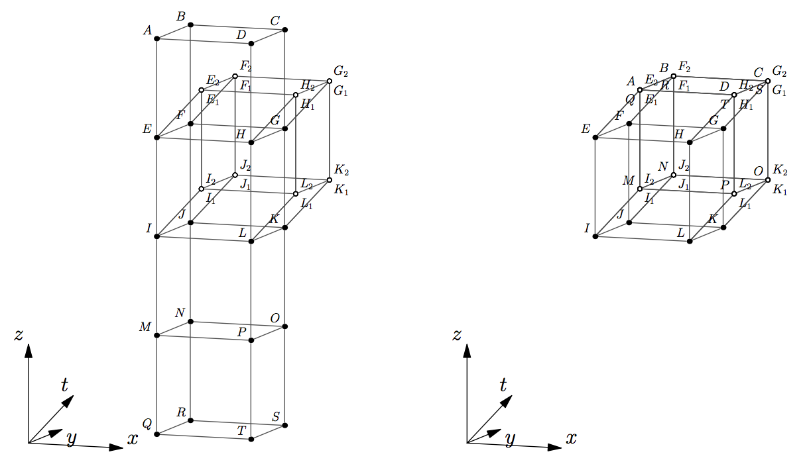

## 문제

Consider a 4-hypercube also known as tesseract. A unit solid tesseract is a 4D figure that is equal to the convex hull of 16 points with Cartesian coordinates (±½, ±½, ±½, ±½) — its vertices. It has 32 edges (1D), 24 square faces (2D), and 8 cubic 3-faces (3D) also known as cells. We study hollow tesseracts and define a tesseract as a boundary of a solid tesseract. Thus, a tesseract is a connected union of 8 solid cubes (its cells) that intersect between each other at 24 tesseract’s square faces, 32 edges, and 16 vertices.

Let’s cut a tesseract along 17 of its 24 faces, so that it still remains connected via 7 faces that were left intact. Unfold the tesseract into a 3D hyperplane by rotating its constituting cubes along the faces that were left intact until all its cells lie in the same 3D hyperplane. The result is called a 3-net of a tesseract. This process is a natural generalization of how a 3D cube is cut and unfolded onto a 2D plane to produce a 2-net of a cube that consists of 6 squares.

In this problem you are given a tree-like 8-polycube in 3D space also known as octocube. An octocube is a collection of 8 unit cubical cells joined face-to-face. More formally, intersection of each pair of cubical cells constituting an octocube is either empty, a point, a unit line (1D), or a unit square (2D). The given octocube is tree-like in the following sense. Consider an adjacency graph of the octocube — a graph with 8 vertices corresponding to its 8 cells. There is an edge in the adjacency graph between pairs of adjacent cells. Two cells of an octocube are called adjacent when their intersection is a square. Cells that intersect at a point or a line are not considered adjacent. An octocube is called tree-like when its adjacency graph is a tree.

Your task is to determine whether the given tree-like octocube constitutes a 3-net of a tesseract. That is, whether this octocube being put onto a hyperplane in 4D space can be folded in 4D space along the squares of intersection between its cells into a tesseract.

For example, look at the leftmost picture below. It shows a wire-frame of the tree-like octocube. Rotate cell GHLKG1H1L1K1 around a plane GHLK and cell FGKJF2G2K2J2 around a plane FGKJ at angle 90 degrees in 4-th dimension outside of the original hyperplane. As a result, point G1 joins with G2 and K1 joins with K2. The face GKK2G2 is glued to face GKK1G1. The result is shown on the right. The 4-th dimension is orthographically projected onto the 3 shown in perspective. The points that have moved out of the original hyperplane are marked with hollow dots.

Rotate EFJIE1F1J1I1 around EFJI and EHLIE2H2L2I2 around EHLI. The result is shown on the following picture on the left. The remaining steps are as follows. Rotate MNOPQRST around MNOP, then rotate both MNOPQRST and IJKLMNOP around IJKL and rotate ABCDEFGH around EFGH. The last step is to glue all faces that meet together to get a tesseract that is shown on the right.

## 입력

The first line of the input file contains there integers m, n, k — the width, the depth, and the height of the box that contains the given octocube (1 ≤ m, n, k ≤ 8). The following k groups of lines describe rectangular slices of the box from top to bottom. Each slice is described by n rows with m characters each. The characters on a line are either ‘.’, denoting an empty space, or ‘x’, denoting a unit cube. The input file is guaranteed to describe a tree-like octocube.

## 출력

Write to the output file a single word “Yes” if the given octocube can be folded into a tesseract or “No” otherwise.
