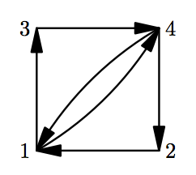

## 문제

King Karl is a responsible and diligent ruler. Each year he travels across his country to make certain that all cities are doing well.

There are n cities in his country and m roads. In order to control the travelers, each road is unidirectional, that is a road from city a to city b can not be passed from b to a.

Karl wants to travel along the roads in such a way that he starts in the capital, visits every non-capital city exactly once, and finishes in the capital again.

As a transport minister, you are obliged to find such a route, or to determine that such a route doesn’t exist.

## 입력

The first line contains two integers n and m (2 ≤ n ≤ 100 000, 0 ≤ m ≤ n + 20) — the number of cities and the number of roads in the country.

Each of the next m lines contains two integers ai and bi (1 ≤ ai, bi ≤ n), meaning that there is a one-way road from city ai to city bi. Cities are numbered from 1 to n. The capital is numbered as 1.

## 출력

If there is a route that passes through each non-capital city exactly once, starting and finishing in the capital, then output n + 1 space-separated integers — a list of cities along the route. Do output the capital city both in the beginning and in the end of the route.

If there is no desired route, output “There is no route, Karl!” (without quotation marks).
