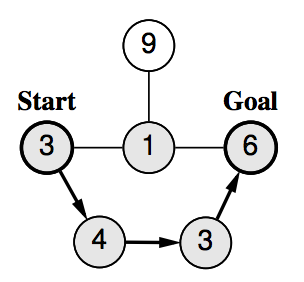

## 문제

As a member of the ICPC (Ibaraki Committee of Physical Competitions), you are responsible for planning the route of a marathon event held in the City of Tsukuba. A great number of runners, from beginners to experts, are expected to take part.

You have at hand a city map that lists all the street segments suited for the event and all the junctions on them. The race is to start at the junction in front of Tsukuba High, and the goal is at the junction in front of City Hall, both of which are marked on the map.

To avoid congestion and confusion of runners of divergent skills, the route should not visit the same junction twice. Consequently, although the street segments can be used in either direction, they can be included at most once in the route. As the main objective of the event is in recreation and health promotion of citizens, time records are not important and the route distance can be arbitrarily decided.

A number of personnel have to be stationed at every junction on the route. Junctions adjacent to them, i.e., junctions connected directly by a street segment to the junctions on the route, also need personnel staffing to keep casual traffic from interfering the race. The same number of personnel is required when a junction is on the route and when it is adjacent to one, but different junctions require different numbers of personnel depending on their sizes and shapes, which are also indicated on the map.

The municipal authorities are eager in reducing the costs including the personnel expense for events of this kind. Your task is to write a program that plans a route with the minimum possible number of personnel required and outputs that number.

## 입력

The input consists of a single test case representing a summary city map, formatted as follows.

```

n m
c1
.
.
.
cn
i1 j1
.
.
.
im jm
```

The first line of a test case has two positive integers, n and m. Here, n indicates the number of junctions in the map (2 ≤ n ≤ 40), and m is the number of street segments connecting adjacent junctions. Junctions are identified by integers 1 through n.

Then comes n lines indicating numbers of personnel required. The k-th line of which, an integer ck (1 ≤ ck ≤ 100), is the number of personnel required for the junction k.

The remaining m lines list street segments between junctions. Each of these lines has two integers ik and jk, representing a segment connecting junctions ik and jk (ik ≠ jk). There is at most one street segment connecting the same pair of junctions.

The race starts at junction 1 and the goal is at junction n. It is guaranteed that there is at least one route connecting the start and the goal junctions.

## 출력

Output an integer indicating the minimum possible number of personnel required.

## 힌트



Figure I.1. The Lowest-Cost Route for Sample Input 1

Figure I.1 shows the lowest-cost route for Sample Input 1. The arrows indicate the route and the circles painted gray are junctions requiring personnel assignment. The minimum number of required personnel is 17 in this case.
