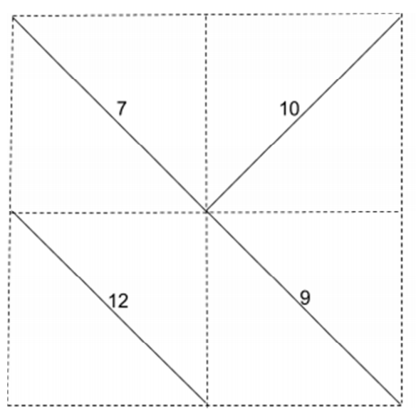

## 문제

There were different types of fish in your aquarium. But they did not go along well with each other. So there had been Fish-War-1 among them. It was a complete mess. Lot of fishes died, many of them hid in some mountain, some were eaten by other fishes and so on. So you decided to compartmentalize your aquarium. You divided your aquarium into R x C grids, that is R rows and C columns. Then you inserted walls into each cell. The walls are slanted, that is it goes from north-east corner to south-west corner or north-west corner to south-east corner. They look like “/” or “\” respectively. Many years passed since the war. Now the fishes want to unite again. They want to bring down the walls. They measured the strength of each of the walls. What is the minimum amount of strength they need to spend to unite all the compartments?

For example, in the following 2 x 2 grid, they can spend 7 + 9 + 12 = 28 unit strength to unite the 4 compartments. And this is the minimum.

## 입력

First line of the input contains number of test case T (<= 20). Hence follows T test cases.

First line of the test case describes number of row R and number of columns C (1 <= R, C <= 100). Next R lines describe the walls. Each of these lines contains C characters and the characters are either “/” or “\”. Next R lines contain C positive integers, each describes the strength of the wall at the corresponding cell. The strength of a wall would be at most 10,000.

## 출력

For each test case output the case number and the minimum amount of strength to unite all the compartments in the aquarium.
