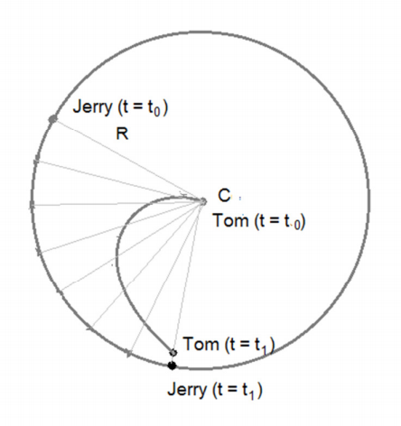

## 문제

Tom and Jerry are very fond of cat and mice games, which might be rather obvious to you. Today they are playing a very complicated game. The goals are simple as usual though, Jerry would be running and Tom would have to catch Jerry.

However, today Jerry is running on a perfect circular path with radius R meters, at a constant speed of V m/s. Initially Tom is sitting at the very center of the circle. He wants to catch Jerry as soon as possible, but we all know, Tom is not very intelligent. Instead of calculating an optimal direction to catch Jerry, he is just running towards Jerry.

As Jerry is also moving, the path Tom has taken start to look like a curve (see picture above). At any given moment, Tom’s position is between Jerry’s current position and the center of the circle. Tom is also moving at a constant speed of V m/s, same speed as Jerry. Find the time (in seconds) Tom would need to catch Jerry.

## 입력

Input file has T (T <= 10000) test cases, each case consists of two integer R and V. Here, 0 < R, V <= 10000.

## 출력

For each test case, print the case number and the time Tom will need to catch Jerry. Floating point rounding error lower than 1e-5 will be ignored by the judge.
