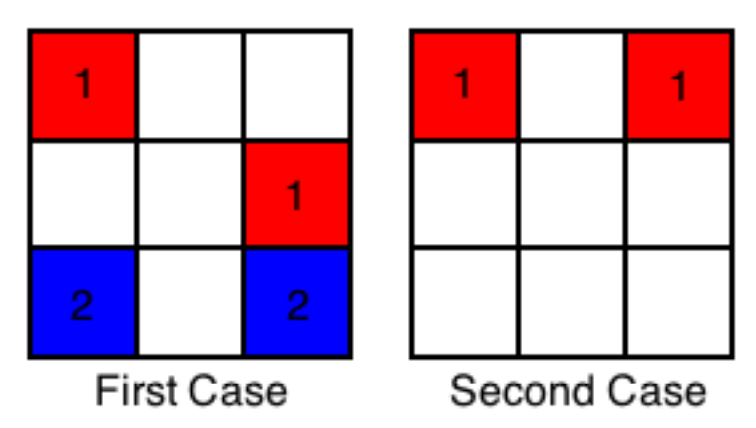
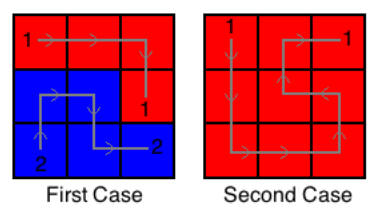

## 문제

“Connect the Cells” is a very famous game, you can find a version of the game on any mobile device.

The game is played on a board of N rows with N cells in each row. Each cell is either empty or colored. We represent an empty cell with ‘0’ and colored cell with a digit from ‘1’ to ‘9’. For each color that exists on the board, there will be exactly 2 cells with that color. Your task is to connect every pair of cells of the same color with each other, without leaving any empty cells.

Two cells are adjacent to each other if they share an edge, vertically or horizontally. Cells colored with the same color in each input grid will never be adjacent to each other.

Here is how you can connect 2 cells of the same color: Let’s say you have a pen for each color and you will use it to color the cells, and once this pen touches any cell it will color it. You will start by putting the pen on one of the 2 cells, and keep moving it from its current cell to another adjacent cell, through empty cells, until you finally move it to the second cell with the same color. Once the pen enters the second cell of that color, these 2 cells are considered connected and you should stop using this pen, and start connecting the other colors (if there are still some left). The pen can not leave the board or color the same cell more than once.

The only exception when the pen can be on an already colored cell, when it’s on the starting cell or the ending cell of its color, and it can be on any of them only once.

Can you write a program to solve this game?

## 입력

Your program will be tested on one or more test cases. The first line of the input will be a single integer T (1 ≤ T ≤ 100) representing the number of test cases. Followed by T test cases. Each test case will start with a line containing an integer N (3 ≤ N ≤ 8) representing the size of the board. Followed by N lines, each one consists of N digits. Each digit represents a cell, with ‘0’ meaning it is an empty cell. It’s guaranteed that there will be at least one valid solution for each test case, and all input boards will satisfy all the conditions mentioned above.

For each test case, if the board contains X distinct colors, they will be named using the digits from 1 to X, inclusive (there will be at least one color and at most 9 colors in each test case).

## 출력

For each test case print a single line containing “Case n:” (without quotes) where n is the test case number (starting from 1) followed by N lines, each line should contain N characters. The j-th character in the i-th line represents the direction you used to exit from the j-th cell in the i-th row in the grid (‘U’ for up, ‘R’ for right, ‘D’ for down, ‘L’ for left and ‘X’ if it was the last cell you entered after connecting the cells of its color). If there are multiple solutions, print any of them.

## 힌트

Here are the 2 sample cases:

And here is a valid solution for each one:

