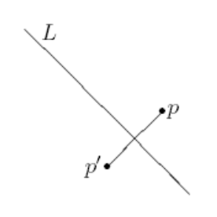

## 문제

Given a point p and a line L on the plane, the refletion of p against L is a point p′ suh that the segment pp′ is perpendiular to L and its middle point is on L. If p is on L, then p′ = p.

Given a set of points on the plane, the axis of symmetry is a line on the plane such that the refletion of any point of the set against that line gives a point from this set. In this problem you are given a set of points on the plane, and you must decide whether there exists at least one axis of symmetry or not.

Because of using real numbers, you may assume that the axis of symmetry is a line L such that for any point of the set p its refletion p′ against the line L lies within 10−6 distance of some point of the set.

## 입력

The input contains several test cases. The first line of each input contains an integer K (1 ≤ K ≤ 10) indicating the number of test cases. The first line of each test case contains an integer N indicating the number of points in the set (1 ≤ N ≤ 100 000). Each of the next N lines describes a single point of the set using two real numbers X and Y separated by a single space (−10 000 ≤ X, Y ≤ 10 000), these numbers represent the coordinates of the point on the plane. You may assume that no two points of each test case have the same location. It is guaranteed that the total sum of values of N for all test cases does not exceed 200 000.

## 출력

For each test case output a single line YES if there exists at least one axis of symmetry for the provided set of points, or NO otherwise.
