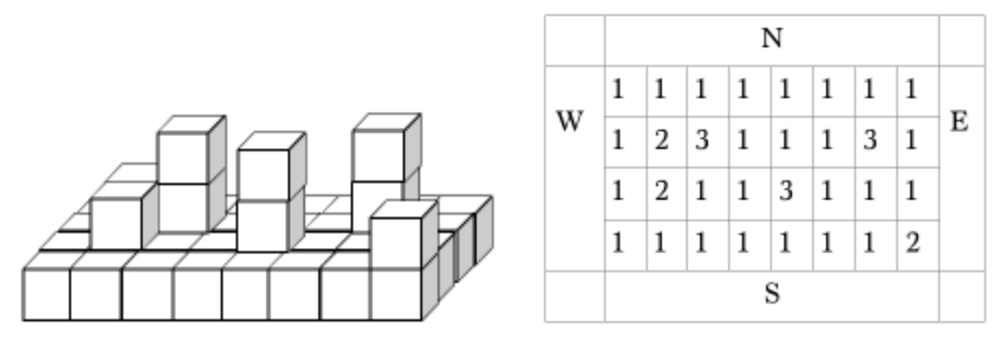
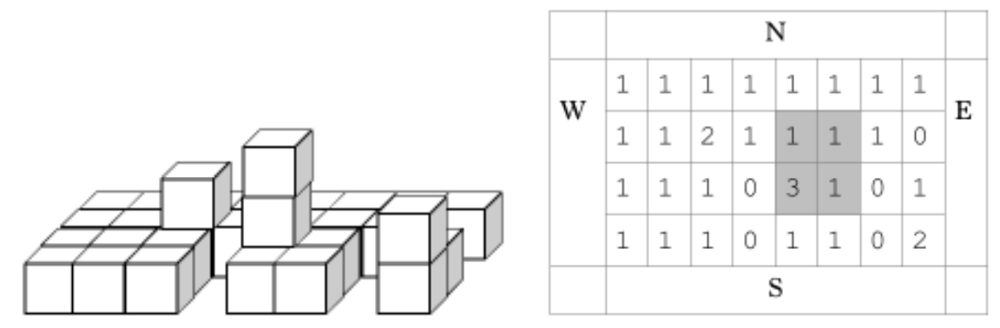

## 문제

Earth security agency needs to destroy enemy alien spaceship. They already damaged it and forced it to land in a desert. Spaceship is built of unit cube blocks and the bottom layer has the form of a N × M rectangle. Top view of the N = 4, M = 8 spaceship shown in the figure.

Spaceship blocks are built from extra-strong metal, that’s why lasers are used for destroying the ship. Laser guns were established by four sides of the spaceship, and they periodically shot laser rays into some blocks of the ship (rays are always perpendicular to the spaceship sides). Each ray destroys R first blocks on its way. If there is one or more blocks atop the destroyed block, they move down.

After K shots it was decided to make an airstrike. For the airstrike it makes sense to choose such area of the ship of size P × P which contains maximal possible number of whole undestroyed blocks. The airstrike will destroy all blocks in this area.

Write a program, which calculates the maximal number of whole undestroyed blocks in the area of size P × P which can be destroyed by airstrike.

## 입력

The first line of the input file contains 5 integers: N, M (1 ≤ N · M ≤ 1 000 000), R (0 < R ≤ 10), K (0 < K ≤ 300 000) and P (0 < P ≤ min(N, M, 10)). Each of the next N lines contain M numbers. Number in i-th row and j-th column is the number of blocks in the corresponding part of the ship (see a figure). Each number is in range 1..106.

Next K lines contain description of laser shots. Each of these lines contain one symbol and two integers (all separated by spaces). Symbol defines the side of the shot: “W” — west, “E” — east, “S” — south, “N” — north. First integer is the number of row (in case of west or east), or the number of column (in case of north and south), and second number is the height of the shot. Rows and columns numbers correspond to numeration of input data, layers are numbered from one. Each number is in range 1..106.

## 출력

Output maximal number of undestroyed blocks after K laser shots in the area of size P × P.

## 힌트

In the figure 2 it’s shown spaceship from the figure 1 after laser shots from example.
