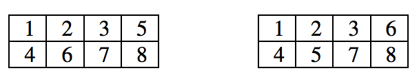

## 문제

Let N be a positive integer. Integers 1, 2, 3, ..., 2N are divided into three sets A, B and C. Write a program table, which calculates the number of ways to fill the table with two rows and N columns so that:

* Each cell of the table contains a single integer;
* The integers of the set A should be written on the first row of the table;
* The integers of the set B should be written on the second row of the table;
* The integers of the set C can be written on any table row;
* The numbers in each row of the table should form an increasing sequence;
* The numbers in each column of the table should form an increasing sequence.

For example, if N = 4 , A = {2, 3} , B = {4, 7, 8} and C = {1, 5, 6} , then there are exactly two tables of required type.

## 입력

On the first row of the standard input is given the integer N (1 < N ≤ 35). On the second row are given M – the number of integers of the set A , and integers of the set A (0 ≤ M ≤ N). On the third row are given K – the number of integers of the set B, and integers of the set B (0 ≤ K ≤ N).

## 출력

The program should print on the standard output a single line holding the result.
