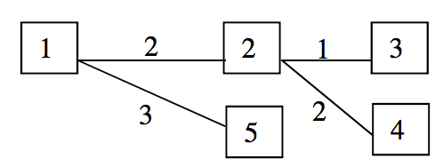
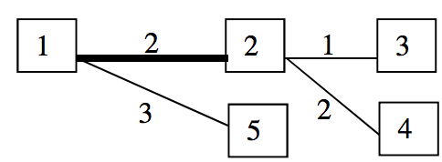
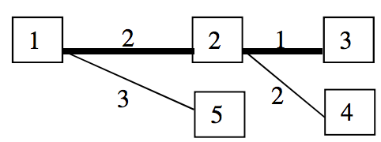
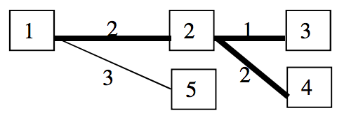
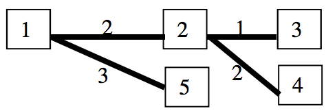

## 문제

In the country X there are N towns, labelled with the numbers from 1 to N. The road network consists of N-1 bidirectional regular roads, each connecting two towns, and having a fixed length – a positive integer. Every one of those roads was built at a different point in time and the road network is designed in such a way that there exists a route between any two towns, which is either a regular road or passes through other towns using regular roads. Since the car traffic increases all the time, the government is planning to replace the regular roads with bidirectional highways. Furthermore, the highways between the towns will be built according to the following rules:

* A highway will be built only between a pair of towns, between which a direct road already exists. The highway replaces the regular road.
* Only a single highway will be under construction at one point in time;
* The highways will be built in the same order, in which the direct roads were built (remember that all the direct roads were built at different times);

We call “an area” of the country any maximal subset of towns and regular roads (no highways) of the initial road network, such that between any two towns in it there is a route, using only regular roads. After building each highway, exactly one area of the country is split up into two areas (it is possible that one or both of the new areas consist of a single town with no roads). A “simple route” is a rout, which can pass through a town at most once. After building each new highway, the government of X would like to know the lengths of the longest simple routes between two towns in each of the two new areas..

Write a program roads, which answers these questions.

## 입력

On the first line of the standard input is given a single positive integer N – the number of towns in the country X.

The next N-1 lines describe the existing road network, before the construction of the highways. On each line, there are three positive integers separated by spaces – the first two denote the labels of the towns between which there is a regular road, and the third is its length.

The regular roads are input in the same order in which they have been built.

## 출력

On the standard output, print out N-1 lines – on the i-th line write two integers, separated by a space – the lengths of the longest simple routes (using only regular roads) between two towns in each of the two new areas which are formed after building the i-th highway. Write the two integers in nondecreasing order.

## 힌트

We denote with {t1, t2,….,tk} an area, which contains the towns t1, t2,….,tk and the regular roads between them.

1. Before building of the first direct highway:

   

   There exists only one area {1, 2, 3, 4, 5}.
2. After building of the first direct highway between towns 1 and 2:

   

   The country splits up into two areas – {1, 5} and {2, 3, 4}. The lengths of the longest simple routes between two towns in each of them are: in {1, 5} – 3 (between towns 1 and 5); in {2, 3, 4} – 3 (between towns 3 and 4).
3. After building of the second direct highway between towns 2 and 3:

   

   The area {2, 3, 4} splits up into two areas – {3} and {2, 4}. The lengths of the longest simple routes in both areas are correspondingly 0 and 2. Output these numbers in increasing order!
4. After building of the third direct highway between towns 2 and 4:

   

   The area {2, 4} splits up into two areas - {2} and {4}. The lengths of the longest simple routes in both areas are 0.
5. After building of the fourth direct highway between towns 1 and 5:

   

   The area {1, 5} splits up into {1} and {5}. The lengths of the longest simple routes are 0.
