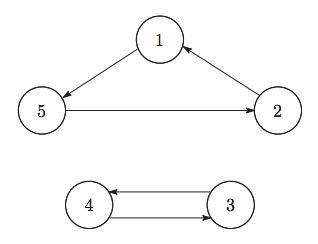

## 문제

In a galaxy far, far away..., there are N highly civilized stars numbered from 1 to N. Each star provides one teleporter. Each teleporter has a fixed destination. We travel through a teleporter only in one direction.

The Galactic Empire Museum of Art holds art exhibitions in stars in the galaxy. Now the exhibition is held in the star 1. The next exhibition will be held in the star where we travel from the star 1 using the teleporters K times.

The Space Police found that a space pirate is planning to steal collections of the museum. The space pirate will crack into the teleporter system, and illegally overwrite the destination of the teleporter in the star a. The destination of the teleporter in the star a will be modified to the star b. The space pirate will crack into the teleporter system of one star only. However, the Space Police could not find the precise values of a, b.

In order to predict the location of the next exhibition, the Space Police would like to know, for each i, the number of pairs (a, b) such that the next exhibition will be held in the star i. To calculate these numbers is a difficult job. Since you are a good programmer, the Space Police asked you to calculate them.

Given the destination of each teleporter, for each i, calculate the number of pairs (a, b) such that the next exhibition will be held in the star i.

## 입력

Read the following data from the standard input.

* The first line of input contains two space separated integers N and K. This means there are N stars in the galaxy, and the next exhibition will be held in the star where we travel from the star 1 using the teleporters K times.
* The i-th line (1 ≤ i ≤ N) of the following N lines contains an integer Ai (1 ≤ Ai ≤ N). This means the current destination of the teleporter in the star i is the star Ai.

All input data satisfy the following conditions.

* 1 ≤ N ≤ 100 000.
* N ≤ K ≤ 1018.

## 출력

Write N lines to the standard output. The i-th line (1 ≤ i ≤ N) should contain an integer, the number of pairs (a, b) such that the next exhibition will be held in the star i.

## 힌트

Note

* The destination of the teleporter in the star i may be the star i itself. In this case, we will stay in the star i if we travel from the star i using the teleporter many times.
* Even if the current destination of the teleporter in the star a is the star b, the space pirate may crack into the teleporter system and overwrite the destination to be the star b. In this case, the destination of the teleporter in the star a will still be the star b; it will not be changed. Such pairs (a, b) should be included when you count the number of pairs (a, b) satisfying the conditions in the task statement.

Sample Input 1

The destination of each teleporter is described in Figure 1.

Figure 1

If (a, b) = (1, 4), the destination of the teleporter in the star 1 will be overwritten to the star 4. The destination of each teleporter will become as in Figure 2. We will arrive at the star 4 if we travel from the star 1 using the teleporters 7 times. Therefore, the next exhibition will be held in the star 4. (We travel as 1 → 4 → 3 → 4 → 3 → 4 → 3 → 4 using the teleporters.)

|  |  |  |
| --- | --- | --- |
|  |  |  |
| Figure 2 | Figure 3 | Figure 4 |

There are three pairs of (a, b) (i.e. (1, 4), (2, 4), (5, 3)) where the next exhibition will be held in the star 4. The location of the next exhibition for each pair (a, b) is summarized in the following table.

|  |  |
| --- | --- |
| 1 | (1,1) |
| 2 | (1,2), (2,2) |
| 3 | (1,3), (2,3), (5,4) |
| 4 | (1,4), (2,4), (5,3) |
| 5 | (1,5), (2,1), (2,5), (3,1), (3,2), (3,3), (3,4), (3,5), (4,1), (4,2) (4,3), (4,4), (4,5), (5,1), (5,2), (5,5) |

When you count the number of pairs (a, b), the pairs (a, b) with a = b should be counted. You should also count the pairs (a, b) such that the destination of the teleporter will not be changed.
