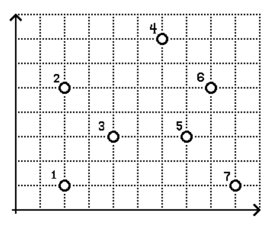
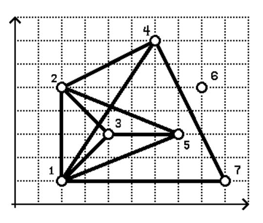

## 문제

21XX년, 당신이 사는 행성은 큰 위기를 맞았고 행성의 대표인 당신은 FTL (Faster Than Light) 엔진을 이용하여 최근에 발견된 "BOJ-1014" 행성으로 사람들을 이주시킬 계획을 세우고 있다.

당신이 사는 행성에는 N개의 나라가 있으며 M개의 우호적 관계가 있고 "BOJ-1014" 행성에는 L (L ≥ N) 개의 거주지역이 있다. 거주지역은 2차원 좌표평면에 나타내었을 때 i번 거주 지역은 Pi(Xi, Yi) (1 ≤ i ≤ L) 에 있다. 각 거주지역에는 오직 한 나라만 들어설 수 있다.

어떤 두 나라가 우호적 관계에 있으면 그 두 나라를 잇는 철도를 건설해야 한다. 철도는 두 나라를 잇는 선분이며 한 철도가 다른 철도와 교차하는 상황이 발생할 수 있다. 철도가 서로 교차하는 점이 있을 때 위험할 수 있고 건설 비용도 더 많이 들어가므로 가능한 교차하는 철도의 쌍을 최소화 하고자 한다.

당신의 행성의 나라와 우호적 관계 그리고 이주할 행성의 정보가 주어졌을 때 나라들을 잘 배치하여 교차하는 철도의 쌍의 개수를 가능한 적게 만드는 프로그램을 작성하자.

## 입력

총 5개의 부분 문제로 구성되어 있으며 한 개의 부분문제는 한 개의 입력 데이터를 가진다. (밑의 힌트 부분을 참조)

입력 파일의 형식은 다음과 같다.

* 첫 번째 줄에는 N과 M이 주어진다. N은 나라의 수를, M은 M개의 우호적 관계가 있음을 뜻한다.
* 다음 j (1 ≤ j ≤ M) 번째 줄에 2개의 정수 Aj와 Bj가 주어지는데 이는 Aj번 나라와 Bj번 나라가 우호관계에 있음을 나타낸다.
* 다음 줄에는 거주지역의 개수 L이 주어진다.
* 다음 i (1 ≤ i ≤ L) 번째 줄에는 2개의 정수 Xi와 Yi가 주어지는데 i번 거주지역 Pi(Xi,Yi) 의 위치를 나타낸다.

모든 입력 데이터는 다음 조건을 만족한다.

* 1 ≤ Aj ≤ N.
* 1 ≤ Bj ≤ N.
* 1 ≤ Xi ≤ 100 000.
* 1 ≤ Yi ≤ 100 000.
* 거주지역 Pi, Pj, Pk (1 ≤ i < j < k ≤ L) 는 하나의 선으로 이어질 수 없다.
* 임의의 두 도시에 대해 철도를 통해 가는 방법이 항상 존재한다.

## 출력

입력 파일에 대하여 출력 데이터를 제출하면 된다. 출력 데이터는 총 N줄로 구성되어 있고 k (1 ≤ k ≤ N) 번째 줄에는 k번 나라가 위치한 지역의 번호가 있어야 한다.

## 힌트

이 문제는 [압축 파일](./001_11936.zip)의 04.txt로 채점을 합니다.

주의

나라를 배치하는 방법에 따라 한 점에서 2개 이상의 철도가 교차할 수 있다.

부분 문제

각 부분 문제에 대하여 N, M, L, S, T 값은 아래의 테이블을 참조하길 바란다. 여기서 S와 T는 점수 측정을 위한 값이다.

| Subtask | N | M | L | S | T |
| --- | --- | --- | --- | --- | --- |
| 1 | 30 | 50 | 60 | 25 | 100 |
| 2 | 125 | 124 | 300 | 0 | 75 |
| 3 | 200 | 2000 | 400 | 110000 | 250000 |
| 4 | 250 | 350 | 250 | 400 | 2000 |
| 5 | 300 | 1600 | 500 | 72000 | 150000 |

점수 측정

이 문제는 출력 데이터를 제출하여 점수를 받을 수 있으며 총 5개의 부분 문제가 있다. 각 부분 문제는 한 개의 데이터 파일로 구성되어 있으며 제출 시 아래의 조건에 따라 점수를 받을 수 있다.

* 만약 출력이 문제 조건에 만족하지 않는 경우, 0점을 받는다.
* 만약 출력이 문제 조건을 만족하는 경우, 점수는 각 부분 점수에 대해 정해져 있는 S와 T에 따라 점수를 받을 수 있다. 출력 데이터에서 교차하는 철도 쌍의 개수를 C라고 하자.
  + T < C 이면 0점을 받는다.
  + S < C ≦ T 이면 \( \lfloor 1 + 19 \times (\frac{T-C}{T-S}) \rfloor \) 여기서 \( \lfloor x \rfloor \) 는 x보다 작거나 같은 정수 중에서 가장 큰 정수를 말한다.
  + C ≤ S 이면 20점을 받는다.

예제 입력과 출력

예제의 입력에선 총 7개의 거주지역이 있으며 아래의 그림과 같다.

총 6개의 나라가 있으며 다음과 같이 배치하고자 한다.

* 1번 나라를 1번 지역으로 배치한다.
* 2번 나라를 5번 지역으로 배치한다.
* 3번 나라를 4번 지역으로 배치한다.
* 4번 나라를 2번 지역으로 배치한다.
* 5번 나라를 7번 지역으로 배치한다.
* 6번 나라를 3번 지역으로 배치한다.

그다음 우호관계에 따라 철도를 건설하면 아래의 그림과 같이 된다. 총 2개의 철도 쌍이 교차하는 것을 알 수 있다.

* 거주지역 1번 (1번 나라가 배치된 곳) 과 거주지역 4번 (3번 나라가 배치된 곳) 을 잇는 철도와 거주지역 2번 (4번 나라가 배치된 곳) 과 거주지역 3번 (6번 나라가 배치된 곳) 잇는 철도가 교차한다.
* 거주지역 1번 (1번 나라가 배치된 곳) 과 거주지역 4번 (3번 나라가 배치된 곳) 을 잇는 철도와 거주지역 2번 (4번 나라가 배치된 곳) 과 거주지역 5번 (2번 나라가 배치된 곳) 잇는 철도가 교차한다.
