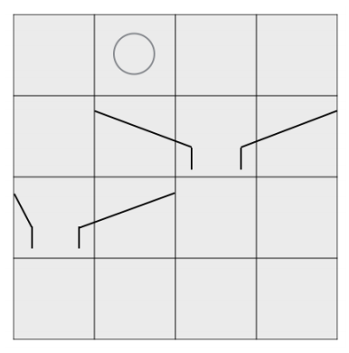
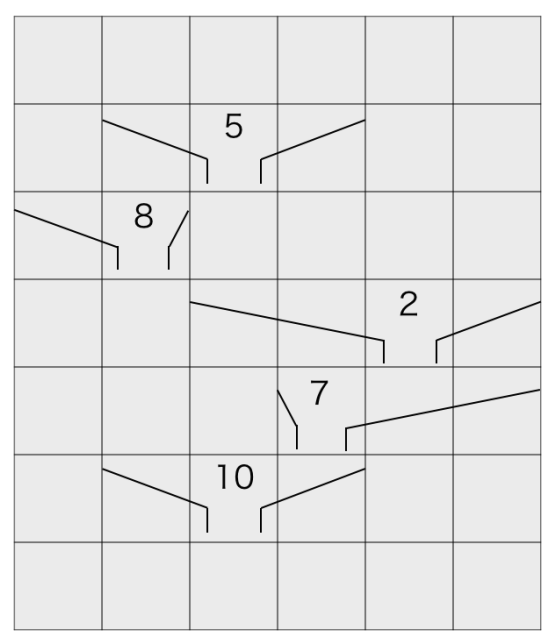
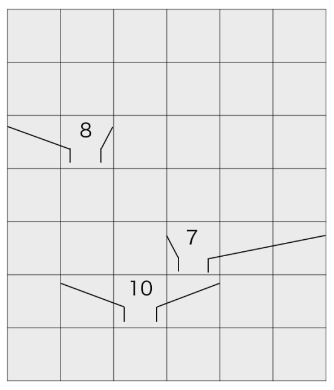

## 문제

상수는 Pinball이라는 게임을 좋아합니다. Pinball의 규칙은 다음과 같습니다.

Pinball의 놀이판은 (M+2)행 N열의 정사각형 격자들로 구성된 격자판입니다. 놀이판의 첫 번째 줄은 판의 꼭대기이고, (M+2)번째 줄은 바닥입니다. i번째 행의 j번째 열에 있는 정사각형 격자는 (i,j)로 표현됩니다.

공은 놀이판의 첫 번째 줄에 있는 격자들 중 하나에 나타나서, 바닥을 향해 수직으로 떨어집니다. 다시 말해, 만약 어떤 공이 (1, i) (1 ≤ i ≤ N)에 나타났다면, 이는 (j, i) (2 ≤ j ≤ M+1)을 통과하여, 바닥의 (M+2, i) 격자에 도착할 것입니다. 상수는 공을 성공적으로 되받아 친다면 점수를 얻게 됩니다.

어느 날, 상수는 공을 되받아치기 어렵다는 것을 눈치챘는데, 공이 바닥의 어떤 격자에나 등장할 수 있기 때문입니다. 상수는 아래에 설명된 장치들을 놀이판 위에 적절하게 설치하여 공이 도달할 수 있는 바닥의 격자가 단 하나 있도록 하려고 합니다.

1이상 M 이하의 번호가 붙은 M개의 장치들이 있습니다. 각 장치는 놀이판의 행들과 평행합니다. i (1 ≤ i ≤ M)번째 장치는 (i+1, Ai)부터 (i+1, Bi)까지의 격자들에 위치해 있습니다. 따라서 이 장치는 총 Bi−Ai+1개의 격자들을 덮습니다. 만약 공이 이 장치가 설치되어 있는 격자에 닿는다면, 공은 (i+1, Ci)로 운반될 것입니다. 그 이후, 이동한 공은 Ci번 열을 따라 수직하게 떨어질 것입니다. 하나의 장치는 공과 한 번 이상 상호 작용하지 않을 것입니다.

상수가 i번째 장치를 설치하기 위해서는 Di원을 지불해야 합니다. 상수는 M개의 장치들 중 일부를 골라서 놀이판에 설치하여, 공이 도달할 수 있는 바닥의 격자가 단 하나 존재하도록 할 것입니다. 상수는 장치들을 효율적으로 설치하여 총 비용을 줄이고자 합니다.

그림: Pinball의 놀이판의 예시입니다. M = 2, N = 4. 공이 첫 번째 행(꼭대기)의 격자 (1, 2)에 등장합니다. 그 다음, 이 공은 (2, 2)로 움직인 후 1번 장치에 의하여 (2, 3)으로 이동할 것입니다. 이 공은 마침내 바닥의 격자 (4, 3)에 도착합니다.

놀이판의 크기와 장치들의 정보가 주어질 때, 공이 도달할 수 있는 바닥 격자가 단 하나 존재하도록 장치들을 설치하기 위한 최소 비용을 구하는 프로그램을 작성하세요.

## 입력

표준 입력으로부터 다음 데이터를 입력받으세요:

* 입력의 첫 번째 줄에는 두 개의 정수 M,N이 공백을 사이로 두고 주어집니다. 이것은 이 놀이판이 (M+2)개의 행과 N개의 열을 가지고 있으며 장치의 수는 M개임을 의미합니다.
* 다음 M개 줄들 중 i번째 줄 (1 ≤ i ≤ M)에는 네 개의 정수 Ai,Bi,Ci,Di가 공백을 사이로 두고 주어집니다. 이것은 i번째 장치가 (i+1, Ai)에서부터 (i+1, Bi)까지의 격자에 설치되어 있다는 것을 의미합니다. i번째 장치는 총 Bi−Ai+1개의 격자를 덮습니다. i번째 장치는 자신이 덮고 있는 격자에 도달한 공을 (i+1, Ci)로 운반할 것입니다. i번째 장치를 설치하기 위해서 Di원의 비용이 발생합니다.

## 출력

표준 출력의 첫 번째 줄에 공이 도달할 수 있는 바닥 격자가 단 하나 존재하도록 장치들을 설치하기 위한 최소 비용을 출력하세요. 만약 이 조건을 만족하도록 장치를 놓는 것이 불가능하다면, −1을 출력하세요.

## 힌트

놀이판과 장치들의 위치는 아래 그림과 같습니다. 각 장치 위에 쓰인 수들은 이 장치를 설치하기 위해 필요한 비용을 나타냅니다.

다섯 개의 장치들 중 2번째, 4번째, 5번째 장치를 두면, 놀이판은 아래와 같게 됩니다.

그러면, 꼭대기의 어떤 격자에 공이 등장하더라도 이 공은 바닥의 (7, 3)에 도달할 것입니다. 이들 장치를 설치하는 데에 드는 총 비용은 25원입니다. 여러분은 25를 출력해야 하는데, 25원보다 적은 비용을 들이면서 공이 도달할 수 있는 바닥의 격자가 단 하나 존재하도록 할 수 없기 때문입니다.
