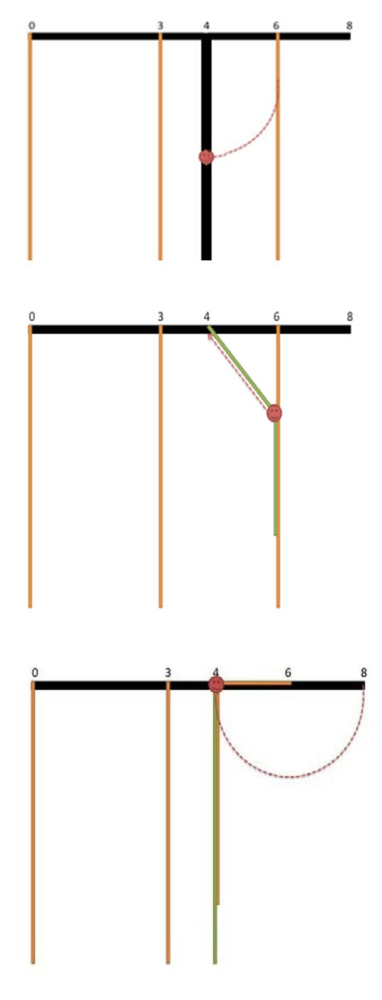

## 문제

A new circus performance involves using really long ropes, hanging from the flat ceiling of the circus hall. The circus hall entrance and all the ropes are positioned in a straight line. The ceiling is 1018 units high and the ropes are hanging freely and they reach the ground. The circus performers must move from one rope to another, so that they can get at least M units away from the entrance.

There are N ropes in total. The i-th rope is hanging from a location that is Pi units from the entrance, as measured along the hall ceiling.

The circus performers are careful and don’t jump crazily from one rope to another. Imagine a circus performer is holding the i-th rope at a distance of S units from the ceiling. The performer can swing on the rope she is holding. If swinging on a rope, the performer reaches a point not less than M units away from the entrance, we can consider her task accomplished. While swinging, the performer can grab another rope, which is hanging from a location that is at most S units away from the first rope. Formally, she can grab the j-th rope if |Pi - Pj|≤ S. Now, the performer holds both the i-th and j-th ropes. At this time, she would start climbing up the i-th rope, while still keeping in hands the j-th rope. When the performer reaches the point where the i-th rope touches the ceiling, she would make sure the j-th rope is pulled tightly along the ceiling. Only at this point, the performer can continue moving, holding on to the j-th rope, at distance from the ceiling based on how the rope was pulled along the ceiling. Formally, the performer continues her movement holding on to the j-th rope at a distance |Pi - Pj| from the ceiling.

The circus manager wants to add an additional, temporary rope, hung on a position that is D units away from the entrance, measured on the ceiling. This is the rope where the performance will start. The performer’s task is to make her way from this rope to the far end of the circus hall: at least M units away from the entrance. During the moving from one rope to another, the temporary rope is indistinguishable from a regular rope. Your program should answer the question: what is the minimal distance from the ceiling that the performer should hold the temporary rope at, so that she can accomplish her task.

Consider an example with 3 permanent ropes, positioned respectively 0, 3 and 6 units away from the entrance. The aim is to reach M = 8.

Consider a temporary rope, 4 units away from the entrance. Imagine a circus performer holding the temporary rope (bold) 3 units away from the ceiling. The performer can reach the rope that is 6 units from the entrance by swinging.

Once the performer grabs the rope that is 6 units away from the entrance, she starts climbing up the first rope (here – the temporary one).

After climbing up the first rope, she is holding the second rope 6 - 4 = 2 units from its base. Now the performer is ready to swing and just able to reach the target that is 8 units away from the entrance.

You need to implement two functions: `init`, which is called once at the beginning of your program’s execution and processes the initial input parameters, and `minLength`, which answers one query given a temporary rope’s location. Your function `minLength` will be called multiple times from the grader program.

* `init(N, M, P[])`
  + `N`: the number of ropes
  + `M`: the target distance in units
  + `P[]`: array of size N that holds the locations of all ropes, measured in units along the ceiling from the entrance
* `minLength(D)`
  + `D`: distance in units along the ceiling from the entrance where the temporary rope will be located

## 입력

* line 1: two integers N and M
* lines 2 + i (0 ≤ i ≤ N-1): Pi
* line N + 2: Q - the number of times `minLength` will be called
* lines N + 3 + i (0 ≤ i ≤ Q-1): numbers D - parameters for each `minLength` call

## 출력

Print Q numbers, one per line, showing the return values of the `minLength`

## 힌트

N = 3, M = 8, P = {0, 3, 6}

`minLength(4)` should return 2. It is possible to jump from the temporary rope to the rope at position 6, holding it 2 units from the ceiling, and then reach M = 8. Another possible sequence of jumps would be to jump from the temporary to the rope at position 0, then to 3, then to 6, and then to reach M = 8. However, the second sequence of jumps would require the performer to hold the temporary rope 4 units from the ceiling in the beginning.

`minLength(5)` should return 3. The performer is allowed to reach the exit even straight from the temporary rope.
