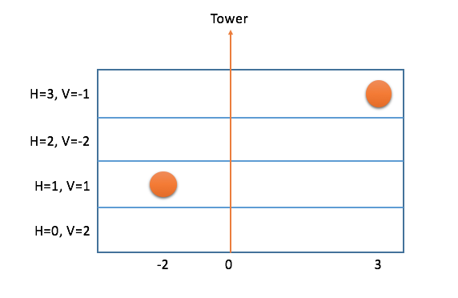

## 문제

The G tech company has deployed many balloons. Sometimes, they need to be collected for maintenance at the company's tower, which is located at horizontal position 0. Each balloon is currently at horizontal position **Pi** and height **Hi**.

G engineers can move a balloon up and down by sending radio signals to tell it to drop ballast or let out air. But they can't move the balloon horizontally; they have to rely on existing winds to do that.

There are **M** different heights where the balloons could be. The winds at different heights may blow in different directions and at different velocities. Specifically, at height j, the wind has velocity **Vj**, with positive velocities meaning that the wind blows left to right, and negative velocities meaning that the wind blows right to left. A balloon at position P at a height with wind velocity V will be at position P+V after one time unit, P+2V after two time units, etc. If a balloon touches the tower, it is immediately collected.

It costs | Horiginal - Hnew | points of energy to move one balloon between two different heights. (This transfer takes no time.) You have **Q** points of energy to spend, although you do not need to spend all of it. What is the least amount of time it will take to collect all the balloons, if you spend energy optimally?

## 입력

The first line of the input gives the number of test cases, **T**. **T** test cases follows. The first line of each case has three integers **N**, **M**, and **Q**, representing the number of balloons, the number of height levels, and the amount of energy available.   
The second line has **M** integers; the jth value on this line (counting starting from 0) is the wind velocity at height j.   
Then, **N** more lines follow. The ith of these lines consists of two integers, **Pi** and **Hi**, representing the position and height of the ith balloon.

Limits

* 1 ≤ **T** ≤ 100.
* 1 ≤ **N** ≤ 10.
* 1 ≤ **M** ≤ 10.
* -10 ≤ **Vj** ≤ 10.
* 1 ≤ **Q** ≤ 10.
* 0 ≤ **Hi** <**M**.
* -10 ≤ **Pi** ≤ 10.

## 출력

For each test case, output one line containing "Case #x: y", where x is the test case number (starting from 1) and y is the minimum number of time units needed to collect all of the balloons, returns IMPOSSIBLE if it's impossible to collect all the balloons using the energy given.

## 힌트

In the sample case, there are two balloons in the sky, and you have 1 energy point to use. The best solution is to immediately spend 1 energy point to move the balloon at position 3, height 3 down to height 2. Once you've done that, it will take 2 time units for both balloons to reach the tower.
