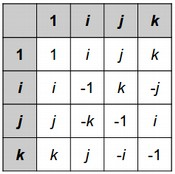

## 문제

The Dutch computer scientist Edsger Dijkstra made many important contributions to the field, including the shortest path finding algorithm that bears his name. This problem is not about that algorithm.  
  
You were marked down one point on an algorithms exam for misspelling "Dijkstra" -- between `D` and `stra`, you wrote some number of characters, each of which was either `i`, `j`, or `k`. You are prepared to argue to get your point back using *quaternions*, an actual number system (extended from complex numbers) with the following multiplicative structure:  
  
  
  
To multiply one quaternion by another, look at the row for the first quaternion and the column for the second quaternion. For example, to multiply *i* by *j*, look in the row for *i* and the column for *j* to find that the answer is *k*. To multiply *j* by *i*, look in the row for *j* and the column for *i* to find that the answer is *-k*.  
  
As you can see from the above examples, the quaternions are not commutative -- that is, there are some **a** and **b** for which **a** \* **b** != **b** \* **a**. However they are associative -- for any **a**, **b**, and **c**, it's true that **a** \* (**b** \* **c**) = (**a** \* **b**) \* **c**.  
  
Negative signs before quaternions work as they normally do -- for any quaternions **a** and **b**, it's true that **-a** \* **-b** = **a** \* **b**, and **-a** \* **b** = **a** \* **-b** = **-(a \* b)**.  
  
You want to argue that your misspelling was equivalent to the correct spelling `ijk` by showing that you can split your string of `i`s, `j`s, and `k`s in two places, forming three substrings, such that the leftmost substring reduces (under quaternion multiplication) to *i*, the middle substring reduces to *j*, and the right substring reduces to *k*. (For example, `jij`would be interpreted as *j* \* *i* \* *j*; *j* \* *i* is -*k*, and -*k* \* *j* is *i*, so `jij` reduces to *i*.) If this is possible, you will get your point back. Can you find a way to do it?

## 입력

The first line of the input gives the number of test cases, **T**. **T** test cases follow. Each consists of one line with two space-separated integers **L** and **X**, followed by another line with **L** characters, all of which are `i`, `j`, or `k`. Note that the string never contains negative signs, `1`s, or any other characters. The string that you are to evaluate is the given string of **L** characters repeated **X** times. For instance, for **L** = 4, **X** = 3, and the given string `kiij`, your input string would be `kiijkiijkiij`.

### Limits

* 1 ≤ **T** ≤ 100.
* 1 ≤ **L** ≤ 10000.
* 1 ≤ **X** ≤ 1012.
* 1 ≤ **L \* X** ≤ 1016.

## 출력

For each test case, output one line containing "Case #x: y", where x is the test case number (starting from 1) and y is either `YES` or `NO`, depending on whether the string can be broken into three parts that reduce to *i*, *j*, and *k*, in that order, as described above.

## 힌트

In Case #1, the string is too short to be split into three substrings.  
  
In Case #2, just split the string into `i`, `j`, and `k`.  
  
In Case #3, the only way to split the string into three parts is `k`, `j`, `i`, and this does not satisfy the conditions.  
  
In Case #4, the string is `jijijijijiji`. It can be split into `jij` (which reduces to *i*), `iji`(which reduces to *j*), and `jijiji` (which reduces to *k*).  
  
In Case #5, no matter how you choose your substrings, none of them can ever reduce to a *j* or a *k*.
