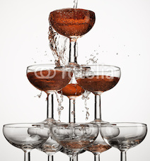

## 문제

At new years party there is a pyramidal arrangement of glasses for wine. For example, at the top level, there would just be one glass, at the second level there would be three, then 6 and then 10 and so on and so forth like the following image.



The glasses are numbered using 2 numbers, L and N. L represents the level of the glass and N represents the number in that level. Numbers in a given level are as follows:

```

Level 1: 
    1

Level 2:
    1
 2     3

Level 3:
      1
   2     3
4     5     6

Level 4:
         1
      2     3
   4     5     6
7     8     9     10
```

Each glass can hold 250ml of wine. The bartender comes and starts pouring wine in the top glass(The glass numbered L = 1 and N = 1) from bottles each of capacity 750ml.

As wine is poured in the glasses, once a glass gets full, it overflows equally into the 3 glasses on the next level below it and touching it, without any wine being spilled outside. It doesn't overflow to the glasses on the same level beside it. It also doesn't overflow to the any level below next level (directly).

For example: When the glass of L = 2 and N = 2 overflows, the water will overflow to glasses of L = 3 and N = 2, 4, 5.

Once that the bartender is done pouring B bottles, figure out how much quantity in ml of wine is present in the glass on level L with glass number N.

## 입력

The first line of the input gives the number of test cases, **T**. **T** test cases follow. Each test case consists of three integers, **B**, **L**, **N**, **B** is the number of bottles the bartender pours and **L** is the glass level in the pyramid and **N** is the number of the glass in that level.

## 출력

For each test case, output one line containing "Case #x: y", where **x** is the test case number (starting from 1) and **y** is the quantity of wine in ml in that glass.

We recommend outputting y to 7 decimal places, but it is not required. y will be considered correct if it is close enough to the correct number: within an absolute or relative error of 10-6.
