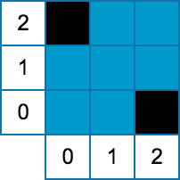
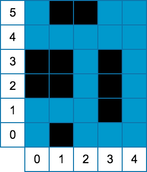

## 문제

Aliens have landed. These aliens find our Earth's rivers intriguing because their home planet has no flowing water at all, and now they want to construct their alien buildings in some of Earth's rivers. You have been tasked with making sure their buildings do not obstruct the flow of these rivers too much, which would cause serious problems. In particular, you need to determine what the maximum flow that the river can sustain is, given the placement of buildings.

The aliens prefer to construct their buildings on stretches of river that are straight and have uniform width. Thus you decide to model the river as a rectangular grid, where each cell has integer coordinates (**X**, **Y**; 0 ≤ **X** < **W** and 0 ≤ **Y** < **H**). Each cell can sustain a flow of 1 unit through it, and the water can flow between edge-adjacent cells. All the cells on the south side of the river (that is with y-coordinate equal to 0) have an implicit incoming flow of 1. All buildings are rectangular and are grid-aligned. The cells that lie under a building cannot sustain any flow. Given these constraints, determine the maximum amount of flow that can reach the cells on the north side of the river (that is with y-coordinate equal to **H**-1).

## 입력

The first line of the input gives the number of test cases, **T**. **T** test cases follow. Each test case will begin with a single line containing three integers, **W**, the width of the river, **H**, the height of the river, and **B**, the number of buildings being placed in the river. The next **B** lines will each contain four integers, **X0**, **Y0**, **X1**, and **Y1**. **X0**, **Y0** are the coordinates of the lower-left corner of the building, and **X1**, **Y1** are the coordinates of the upper-right corner of the building. Buildings will not overlap, although two buildings can share an edge.

Limits

* 1 ≤ **T** ≤ 100.
* 0 ≤ **X0** ≤ **X1** < **W**.
* 0 ≤ **Y0** ≤ **Y1** < **H**.
* 3 ≤ **W** ≤ 1000.
* 3 ≤ **H** ≤ 108.
* 0 ≤ **B** ≤ 1000.

## 출력

For each test case, output one line containing "Case #x: m", where x is the test case number (starting from 1) and m is the maximum flow that can pass through the river.

## 힌트

Here are visual representations of the two test cases in the sample input:

    
