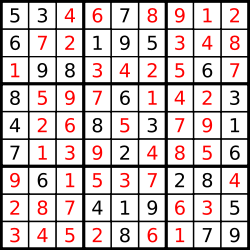

## 문제

**Sudoku** is a popular single player game. The objective is to fill a 9x9 matrix with digits so that each column, each row, and all 9 non-overlapping 3x3 sub-matrices contain all of the digits from 1 through 9. Each 9x9 matrix is partially completed at the start of game play and typically has a unique solution.

Given a completed **N****2**x**N****2** Sudoku matrix, your task is to determine whether it is a *valid* solution. A *valid* solution must satisfy the following criteria:

* Each row contains each number from **1** to **N****2**, once each.
* Each column contains each number from **1** to **N****2**, once each.
* Divide the **N****2**x**N****2** matrix into **N****2** non-overlapping **N**x**N** sub-matrices. Each sub-matrix contains each number from **1** to **N****2**, once each.

You don't need to worry about the uniqueness of the problem. Just check if the given matrix is a valid solution.

## 입력

The first line of the input gives the number of test cases, **T**. **T** test cases follow. Each test case starts with an integer **N**. The next **N****2** lines describe a completed Sudoku solution, with each line contains exactly **N****2** integers. All input integers are positive and less than 1000.

Limits

* 1 ≤ **T** ≤ 100.
* 3 ≤ **N** ≤ 6.

## 출력

For each test case, output one line containing "Case #x: y", where x is the case number (starting from 1) and y is "Yes" (quotes for clarity only) if it is a valid solution, or "No" (quotes for clarity only) if it is invalid. Note that the judge is case-sensitive, so answers of "yes" and "no" will not be accepted.
