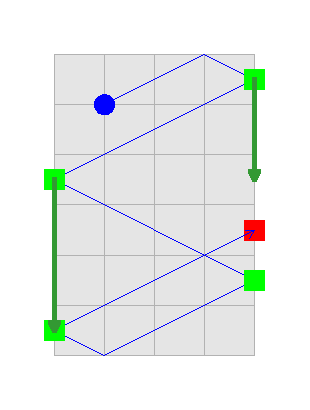

## 문제

Two teams of players play pong. Pong is a simple computer game, where each player controls a paddle (which we assume to be a point), and a little ball bounces back and forth. The players in one team are required to bounce the ball in a fixed cyclic order (so in a three-player team, the first one to touch the ball would be P1, then P2, then P3 and only then P1 again), until one of the players doesn't manage to bounce it, at which point the ball leaves the playing field and this player's team loses.

To be more precise: the playing field is a rectangle of size **A**x**B**. On each vertical wall (of length **A**) there are a number of paddles, one for each player of the team guarding this wall. Each paddle is a point. All the paddles of the players on one team move vertically at the same speed (in units per second), and can pass each other freely. There is also a ball, for which we are given its initial position (horizontal and vertical, counted from the lower-left corner) and initial speed (horizontal and vertical, again in units per second). The players are allowed to choose the initial positioning of their paddles on their vertical walls knowing the initial position of the ball. Whenever the ball reaches a horizontal wall, it bounces off (with the angle of incidence equal to the angle of reflection). Whenever it reaches a vertical end of the field, if the paddle of the player who is supposed to touch the ball now is there, it bounces off, while if there isn't, the team of the player whose paddle was supposed to be there loses.

The game can take quite a long time, with the players bouncing the ball back and forth. Your goal is to determine the final result (assuming all players play optimally).

## 입력

The first line of the input gives the number of test cases, **T**. **T** test cases follow. Each test case consists of four lines. The first line contains two integers, **A** and **B**, describing the height and width of the playing field. The second line contains two integers, **N** and **M**, describing the sizes of the two teams: **N** is the number of players on the team with paddles on the **X** = 0 wall, and **M** is the number of players on the team with paddles on **X** = **B** wall. The third line contains two integers, **V** and **W**, describing the speed of the paddles of players in the first and second team, respectively. The fourth line contains four integers: **Y**, **X**, **V****Y** and **V****X**, describing the initial position (vertical and horizontal) and initial speed of the ball (the ball moves by **V****Y** units up and **V****X** to the right each second, until it bounces).

Limits

* 1 ≤ **T** ≤ 100.
* 0 < **X** < **B**
* 0 < **Y** < **A**
* 1 ≤ **N**, **M** ≤ 106
* 1 ≤ **V**, **W** ≤ 1012
* -1012 ≤ **V****Y** ≤ 1012
* -106 ≤ **V****X** ≤ 106
* 2 ≤ **A**, **B** ≤ 106

## 출력

For each test case, output one line containing "Case #x: y", where x is the case number (starting from 1) and y is one of the three possible outputs: "DRAW" (if the game can proceed forever), "LEFT z", if the team with paddles on **x** = 0 wins, and the opposing team can bounce the ball at most z times, or "RIGHT z" if the team with paddles on **X** = **B** wins and the opposing team can bounce the ball at most z times.

## 힌트

The picture depicts the gameplay in the first sample case. The ball bounces off the right wall at time 0.375 (the first RIGHT player intercepts it, for instance by beginning with her paddle there and not moving it), then off the left wall at 0.875 (the LEFT player bounces it), again on the right at time 1.375 (the second RIGHT player can position his paddle at the bounce point), again on the left (where the LEFT player gets just in time to catch it — she covers the three units of distance exactly in one second in which she needs to get there) and then hits the right wall too far for the first RIGHT player to get there. Note the second RIGHT player could catch the ball, but is not allowed by the rules to do so. Also note that if RIGHT team had one player more, she could bounce the ball, and then LEFT would lose — the ball would come too far up for the single LEFT player to get there in time.
