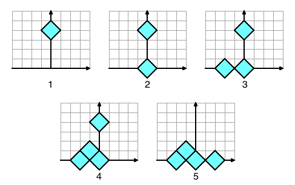

## 문제

Diamonds are falling from the sky. People are now buying up locations where the diamonds can land, just to own a diamond if one does land there. You have been offered one such place, and want to know whether it is a good deal.

Diamonds are shaped like, you guessed it, diamonds: they are squares with vertices (X-1, Y), (X, Y+1), (X+1, Y) and (X, Y-1) for some X, Y which we call the center of the diamond. All the diamonds are always in the X-Y plane. X is the horizontal direction, Y is the vertical direction. The ground is at Y=0, and positive Y coordinates are above the ground.

The diamonds fall one at a time along the Y axis. This means that they start at (0, Y) with Y very large, and fall vertically down, until they hit either the ground or another diamond.

When a diamond hits the ground, it falls until it is buried into the ground up to its center, and then stops moving. This effectively means that all diamonds stop falling or sliding if their center reaches Y=0.

When a diamond hits another diamond, vertex to vertex, it can start sliding down, without turning, in one of the two possible directions: down and left, or down and right. If there is no diamond immediately blocking either of the sides, it slides left or right with equal probability. If there is a diamond blocking one of the sides, the falling diamond will slide to the other side until it is blocked by another diamond, or becomes buried in the ground. If there are diamonds blocking the paths to the left and to the right, the diamond just stops.

Consider the example in the picture. The first diamond hits the ground and stops when halfway buried, with its center at (0, 0). The second diamond may slide either to the left or to the right with equal probability. Here, it happened to go left. It stops buried in the ground next to the first diamond, at (-2, 0). The third diamond will also hit the first one. Then it will either randomly slide to the right and stop in the ground, or slide to the left, and stop between and above the two already-placed diamonds. It again happened to go left, so it stopped at (-1, 1). The fourth diamond has no choice: it will slide right, and stop in the ground at (2, 0).

## 입력

The first line of the input gives the number of test cases, **T**. **T** lines follow. Each line contains three integers: the number of falling diamonds **N**, and the position **X, Y** of the place you are interested in. Note the place that you are interested in buying does not have to be at or near the ground.

Limits

* 1 ≤ **T** ≤ 100.
* -10,000 ≤ **X** ≤ 10,000.
* 0 ≤ **Y** ≤ 10,000.
* **X + Y** is even.
* 1 ≤ **N** ≤ 106.

## 출력

For each test case output one line containing "Case #x: p", where x is the case number (starting from 1) and p is the probability that one of the **N** diamonds will fall so that its center ends up exactly at (**X**, **Y**). The answer will be considered correct if it is within an absolute error of 10-6 away from the correct answer.
