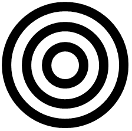

## 문제

Maria has been hired by the Ghastly Chemicals Junkies (GCJ) company to help them manufacture **bullseyes**. A **bullseye** consists of a number of concentric rings (rings that are centered at the same point), and it usually represents an archery target. GCJ is interested in manufacturing black-and-white bullseyes.

Maria starts with **t** millilitres of black paint, which she will use to draw rings of thickness 1cm (one centimetre). A ring of thickness 1cm is the space between two concentric circles whose radii differ by 1cm.

Maria draws the first black ring around a white circle of radius **r** cm. Then she repeats the following process for as long as she has enough paint to do so:

1. Maria imagines a white ring of thickness 1cm around the last black ring.
2. Then she draws a new black ring of thickness 1cm around that white ring.

Note that each "white ring" is simply the space between two black rings.

The area of a disk with radius 1cm is **π** cm2. One millilitre of paint is required to cover area **π** cm2. What is the maximum number of black rings that Maria can draw? Please note that:

* Maria only draws complete rings. If the remaining paint is not enough to draw a complete black ring, she stops painting immediately.
* There will always be enough paint to draw at least one black ring.

## 입력

The first line of the input gives the number of test cases, **T**. **T** test cases follow. Each test case consists of a line containing two space separated integers: **r** and **t.**

Limits

* 1 ≤ **T** ≤ 6000.
* 1 ≤ **r** ≤ 1018.
* 1 ≤ **t** ≤ 2 × 1018.

## 출력

For each test case, output one line containing "Case #**x**: **y**", where **x** is the case number (starting from 1) and **y** is the maximum number of black rings that Maria can draw.
